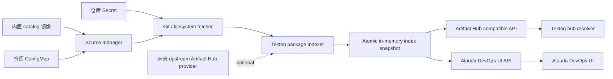

# Artifact Hub Shim 设计与实现方案

## 背景

当前 Tekton 发行版中通过自有 Tekton Hub 为 Pipeline hub resolver 和 Alauda DevOps UI 提供 catalog Task / Pipeline 数据。随着 Tekton 社区逐步转向 Artifact Hub，产品侧希望替换现有 Tekton Hub 依赖，并提供一个不依赖 PostgreSQL 等重型组件的轻量服务。这个插件需要满足三类核心场景：

- 为 Tekton hub resolver 提供其依赖的 Artifact Hub API。
- 为 Alauda DevOps UI 提供当前 Hub 资源列表、详情、版本和 YAML 读取所需的 API。
- 基于现有 Alauda catalog 内容导入 Task、Pipeline、StepAction，并支持通过配置追加新的 catalog 仓库来源。

此前已经验证过基于 upstream Artifact Hub 的集群插件交付链路：可以打包私有 Artifact Hub 插件，也可以通过本地 catalog bootstrap 让 upstream Artifact Hub 索引 Task、Pipeline、StepAction。但该方案仍然保留 upstream Artifact Hub 的 PostgreSQL、tracker、db-migrator、repository records 等完整后端模型。

本方案有意收窄范围：只实现 Tekton resolver 与 Alauda DevOps UI 当前需要的 Artifact Hub 兼容能力，并用本地 catalog 内容和轻量级内存索引承载数据，不引入 PostgreSQL、Redis、搜索引擎或完整 Artifact Hub 后端。

## 命名

新插件命名为 `artifacthub-shim`。

`shim` 通常表示一个很薄的兼容层或适配层，位于调用方和真实实现之间。它对外呈现调用方期望的接口，对内把请求转换到更简单或不同的后端实现。这个语义与本插件的目标一致：

- Tekton hub resolver 期望访问 Artifact Hub package API。
- Alauda DevOps UI 期望访问 hub-wrapper 风格的资源列表和详情 API。
- 实际数据来源不是完整 Artifact Hub，而是本地 catalog、额外配置的 Git 仓库，以及未来可能接入的客户自有 Artifact Hub。

因此，`artifacthub-shim` 比 `artifacthub-lite` 更准确。`lite` 容易让人理解为“完整 Artifact Hub 的轻量发行版”，而 `shim` 明确表达这是一个 Artifact Hub API 兼容中间层，只覆盖 Tekton catalog 消费所需的 API 面。

这个命名可以类比 `containerd-shim` 的“中间层”概念。`containerd-shim` 位于 containerd 与具体 runtime/container 进程之间，负责隔离生命周期、stdio 和退出状态等细节。`artifacthub-shim` 则位于 Tekton resolver / Alauda DevOps UI 与 catalog 元数据来源之间，负责隔离 API 兼容、索引和数据来源细节。两者领域不同，但“shim 作为兼容边界”的含义一致。

## 目标

- 提供 Tekton hub resolver 使用的 Artifact Hub API 子集，覆盖 `Task`、`Pipeline`、`StepAction`。
- 提供 Alauda DevOps UI 需要的 `/api/v1alpha1` 资源 API，覆盖列表、详情、版本、README、manifest 等基础交互。
- 支持从 Alauda catalog 镜像导入内置 Task、Pipeline、StepAction，满足离线环境开箱可用。
- 支持多个团队通过带 label 的 ConfigMap 配置额外仓库来源。
- 支持每个外部仓库使用独立 Secret 引用凭据。
- 支持通过配置禁用 catalog 中的指定资源或指定版本。
- 运行时保持轻量：一个 API 服务，不依赖 PostgreSQL、Redis、搜索引擎或 scanner。
- 兼容期复用现有 hubs-wrapper `/hub` 入口，由 tektoncd-hubs-api 在 artifact 模式下识别 artifacthub-shim 并代理 UI API。
- 为后续接入客户自有 upstream Artifact Hub 预留 provider 扩展点。

## 非目标

- 不完整复刻 Artifact Hub 后端、站点、用户体系、仓库认领、收藏、评分、订阅、webhook、scanner、统计或完整权限模型。
- 不在本任务中完成现有 catalog 中所有 Task、Pipeline 的批量迁移。
- 不提供完整 Tekton Hub API 兼容层。
- 不设计现有 Tekton Hub 引用平滑迁移到 Artifact Hub 引用的完整方案。
- 不在本阶段由 artifacthub-shim 自动修改 TektonConfig、接管 `/hub` Ingress 或彻底下线 tektoncd-hubs-api；首版先通过 tektoncd-hubs-api 兼容桥接减少迁移风险。

## 当前系统观察

- 根据 tektoncd-pipeline 的 `upstream/pkg/resolution/resolver/hub` 和 `upstream/docs/hub-resolver.md`，Tekton hub resolver 的 resolver type 是 `hub`，`type=artifact` 是推荐模式，`type=tekton` 已处于 deprecated 路径。
- resolver 的 Artifact Hub base URL 来自 resolver Deployment 的 `ARTIFACT_HUB_API` 环境变量；未配置时默认访问 `https://artifacthub.io`。把 `hubresolver-config` 中的 `default-type` 改为 `artifact`，并把 `artifact-hub-api` 指向 artifacthub-shim，是 Tekton hub resolver 原有配置能力，不需要由 artifacthub-shim 在首版中自动修改。
- resolver 在 `type=artifact` 模式下只依赖两个 Artifact Hub endpoint 形态：
  - 精确版本或已解析版本的 manifest 读取：`GET /api/v1/packages/tekton-{kind}/{repo}/{name}/{version}`。
  - 版本约束解析前的版本列表读取：`GET /api/v1/packages/tekton-{kind}/{repo}/{name}`。
- manifest 读取响应只被 resolver 解析 `data.manifestRaw` 字段。HTTP 状态必须是 `200`，否则 resolver 会把请求视为未找到或失败。
- resolver 会先用 `hashicorp/go-version.NewConstraint` 解析 `version` 参数。只要解析成功，包括 `"0.1"`、`"0.1.0"` 这类精确 SemVer，也会先请求 version-list endpoint，从 `available_versions` 中选择满足条件的最高非 prerelease 版本，再请求 detail endpoint。因此首版必须同时实现 version-list 和 detail endpoint，不能只实现 detail endpoint。
- 版本列表响应只被 resolver 解析 `available_versions[].version` 和 `available_versions[].prerelease`。resolver 会跳过 `prerelease=true` 的版本，并用 `hashicorp/go-version` 选择满足约束的最高版本。
- resolver 支持的 `kind` 当前为 `task`、`pipeline`、`stepaction`。但默认 Artifact Hub catalog 配置只有 `default-artifact-hub-task-catalog` 和 `default-artifact-hub-pipeline-catalog`，没有 StepAction 默认 catalog；因此 StepAction 引用必须显式传入 `catalog`，除非后续 Tekton upstream 增加默认 StepAction catalog 配置。
- `tektoncd-hubs-api` 已经有 `/api/v1alpha1` 的 UI-facing API 模型，但其中 Artifact Hub client 还未实现，且当前配置读取只使用 `TEKTON_HUB_API`，没有真正使用 `ARTIFACT_HUB_API`。兼容期需要补齐 shim-aware direct proxy。
- 现有 `artifacthub` 仓库证明了集群插件打包和本地 catalog bootstrap 可行，但它仍然依赖 upstream Artifact Hub 的存储和 tracker 模型。
- `catalog` 的版本化资源目录遵循 `{kind}/{name}/{version}/{name}.yaml`。当前 `artifacthub-shim` 不读取
  `artifacthub-repo.yml`；内置 repository 名称由 shim 的 source 配置决定，默认映射为 `catalog`、
  `catalog-pipelines` 和 `catalog-stepactions`。

## 整体架构



插件交付为单个 Go API server Deployment。服务维护一份只读的原子索引快照，所有读请求都从当前快照读取。刷新流程在后台构建新快照，只有当完整索引成功后才替换当前快照。如果刷新失败，服务保留上一份可用快照，避免短暂仓库故障影响 resolver 和 UI 读取。

### 主要组件

- `api server`：提供 Artifact Hub 兼容 API、Alauda DevOps UI API、health、readiness 和 metrics。
- `source manager`：从 Helm values 和带 label 的 ConfigMap 发现启用的仓库来源。
- `fetcher`：读取内置 catalog 目录，或 clone / refresh 外部 Git 仓库。
- `indexer`：解析 Tekton manifest、README、Artifact Hub annotations、Tekton annotations 和版本目录。
- `snapshot store`：在内存中保存最新成功索引结果，并用原子替换保证读路径无锁或低锁。
- `provider interface`：当前实现本地 catalog provider，后续可增加 upstream Artifact Hub provider。

## 数据模型

内部索引模型应保持小而明确：

```go
// PackageKind identifies the Tekton resource type indexed by artifacthub-shim.
type PackageKind string

// RepositorySource describes one configured catalog source before indexing.
type RepositorySource struct {
    Name          string
    Kind          PackageKind
    URL           string
    Revision      string
    Path          string
    CredentialRef string
    Disabled      []DisabledPackage
}

// PackageRecord is the package-level metadata served to Artifact Hub and UI APIs.
type PackageRecord struct {
    Repository    RepositoryInfo
    Kind          PackageKind
    Name          string
    DisplayName   string
    Description   string
    Keywords      []string
    LatestVersion string
    Versions      []VersionRecord
}

// VersionRecord stores one immutable package version and content references.
type VersionRecord struct {
    Version           string
    NormalizedVersion string
    Readme           ContentRef
    Manifest         ContentRef
    Digest           string
    Prerelease       bool
    Deprecated       bool
    CreatedAt        string
    Annotations      map[string]string
    Labels           map[string]string
}

// ContentRef identifies an immutable payload stored outside the metadata index.
type ContentRef struct {
    Digest string
    Path   string
    Size   int64
}
```

版本排序需要 SemVer-aware，但也要兼容 catalog 当前常见的 `0.1` 版本形式。Tekton resolver 在 `type=artifact` 下会把两段式版本补成三段式版本，例如把 `0.1` 请求改成 `0.1.0`。因此索引时应同时保存原始版本和标准化版本：

- `Version` 保存 catalog 目录中的原始版本，用于 UI 展示和 source 追踪。
- `NormalizedVersion` 保存三段式 SemVer，用于 resolver lookup、constraint 选择和去重。
- 如果同一个 package 下同时出现 `0.1` 与 `0.1.0`，应视为冲突并拒绝该 source 的新快照，避免 resolver 请求歧义。

## 资源身份与重名处理

多个仓库同时配置后，Task、Pipeline 或 StepAction 名称重名是正常场景，不能把 `name` 作为全局唯一标识。需要对齐 Tekton Hub 和 Artifact Hub 的身份模型：

- Tekton Hub 的资源详情 API 使用 `catalog/kind/name` 和 `catalog/kind/name/version` 定位资源。其同步逻辑按 `CatalogID + Kind + Name` 查找或创建资源，并把版本挂到同一个资源下。因此同名资源可以存在于不同 catalog 中；同一个 catalog 内的同 kind/name 表示同一个资源的多个版本。
- Artifact Hub 的 repository 名称是 package 访问路径的一部分，package 表的唯一约束是 `repository_id + name`，snapshot 的主键是 `package_id + version`。因此同名 package 可以存在于不同 repository 中；同一个 repository 内的同名 package 才会被视为同一个 package。
- Artifact Hub 的 Tekton package detail endpoint 形态为 `/api/v1/packages/tekton-{kind}/{repository}/{package}/{version}`，resolver 也总是带着 `catalog` 参数访问该路径。这个 `catalog` 在 shim 中应等价于 Artifact Hub `repository.name`。

基于以上观察，shim 的首版规则如下：

- `RepositorySource.Name` 作为对外 `repository.name` / resolver `catalog` 使用，必须在有效 source 集合内全局唯一。校验时建议使用大小写不敏感的 canonical name，避免 `Team-A` 和 `team-a` 在 URL、UI 或 resolver 参数中产生歧义。
- package 身份使用 `{kind, repository, normalizedPackageName}`。version 身份使用 `{kind, repository, normalizedPackageName, normalizedVersion}`。
- 不同 repository 下允许存在同名 Task/Pipeline/StepAction。搜索和 UI 列表不得仅按 `name` 去重，必须把 repository/catalog 展示出来；详情 API 和 resolver API 必须携带 repository/catalog。
- 同一个 repository、同一个 kind、同一个 package name 下的不同 version 会合并为同一个 package 的版本列表；但这个 package identity 只能来自一个 source/package directory。
- 同一个 repository、同一个 kind、同一个 package name、同一个 normalized version 出现多份 manifest 时视为该 source 的内容冲突，包括 `0.1` 与 `0.1.0` 归一化后冲突。冲突不会影响其他 repository。
- 两个不同 ConfigMap 或 provider 如果声明了相同 `RepositorySource.Name`，首版直接判定为 repository name 配置冲突，不做隐式优先级、不做跨 source 合并。冲突组中的 source 都不会进入下一份快照；其他 repository 不受影响。后续若确实需要 overlay 或 priority，必须作为显式 shim-only 能力设计，并说明如何降级到 upstream Artifact Hub。
- `disabledPackages` 规则必须按 repository + kind + package name 生效，不能因为某个仓库禁用了 `buildah` 就隐藏另一个仓库中的 `buildah`。

## 开发实现思路

首版实现把数据加载、索引构建和 HTTP 输出拆成清晰的包边界，API handler 不直接处理 Git、YAML 或版本排序逻辑。当前代码中的包职责如下：

- `pkg/config`：读取进程环境变量，完成默认值、duration、boolean 和静态 source descriptor 解析。repository ConfigMap 内容不在这里解析。
- `pkg/repository`：解析带 label 的 repository ConfigMap，校验 `repository.yaml`，通过 informer watch ConfigMap/Secret，并从 Secret 解析 Git credential。
- `pkg/source`：定义 `RepositorySource`、`SourceSnapshot`、`Provider`、`CredentialProvider` 等 source 抽象；同时实现 filesystem provider 与 Git provider。Git clone/fetch、credential material 临时落盘、CA bundle、SSH known hosts 和 workdir 隔离目前都在 `pkg/source/git.go` 中完成，没有独立 `pkg/fetcher` 包。
- `pkg/tekton`：解析 Tekton YAML，识别 `Task`、`Pipeline`、`StepAction` 所需的最小 metadata，抽取 annotations、labels、`spec.description`、display name、tags、platforms 和 artifacthub annotations。该包不感知仓库来源，也不感知 HTTP。
- `pkg/index`：把 provider 输出的 package 文件组织成 `IndexSnapshot`，完成版本标准化、冲突检测、disabled rules、倒排搜索 token、detail lookup map 和 UI list cache。manifest/README 在配置 ContentStore 时保存为 digest/path 引用；无 ContentStore 时通过 `ContentRef.Data` 保持内存模式。
- `pkg/content`：维护本地 digest ContentStore、content GC、soft limit 检查和按 digest 的有界 payload cache。
- `pkg/api`：提供 Artifact Hub 兼容 API、Alauda DevOps UI API、health/readiness、snapshot summary 和 `/metrics`。当前没有拆成 `pkg/api/artifacthub` 与 `pkg/api/uiv1alpha1` 子包，而是在同一个包内由不同文件分担。
- `pkg/runtime`：维护 `RefreshController` 与原子 `Store`。refresh controller 使用受限 worker pool 并发加载多个 source，保存每个 source 的 last-good shard，并在发布快照前执行 ContentStore GC 与 soft limit 检查。

核心接口建议：

```go
// Provider loads package source files from one configured source.
type Provider interface {
    // Load returns a file-level snapshot for one configured source.
    Load(ctx context.Context, source RepositorySource) (SourceSnapshot, error)
}

// Builder builds an immutable runtime index from all source snapshots.
type Builder interface {
    // Build validates all source snapshots and creates a complete immutable index.
    Build(ctx context.Context, sources []SourceSnapshot) (*IndexSnapshot, error)
}

// Store exposes the latest successful index to read paths.
type Store interface {
    // Current returns the latest successfully built snapshot.
    Current() *IndexSnapshot

    // Swap publishes a validated snapshot atomically.
    Swap(next *IndexSnapshot)
}
```

当前刷新流程：

1. `SourceManager` 从静态配置和 labeled ConfigMap 生成 source 列表。
2. `SourceManager` 先做配置级校验，把 repository name 重复、字段缺失、Secret 引用非法等问题记录为 source status，并把这些 source 从本轮有效 source 集合中剔除。
3. `RefreshController` 当前串行调用有效 source provider。单个 source 同步失败时不阻断其他 source，同步失败的 source 使用上一份 last-good shard；如果没有 last-good shard，则该 source 暂时不进入快照。后续可把 source 加载阶段改为受限并发，但需要保持同一轮 refresh 的结果顺序稳定、last-good 更新原子化，以及同一 source 的工作目录不被并发写入。
4. `Builder` 在内存中构建完整候选快照，包含按 kind/repo/name/version 的 detail map、按 kind/repo/name 的 version list、搜索 token map、UI list cache，并校验 package identity 和 version identity 的唯一性。
5. 候选快照通过完整校验后，调用 `Store.Swap` 原子替换。
6. API handler 每次请求只读 `Store.Current()` 返回的快照，不触发 source IO。

关键实现细节：

- Git source 使用本地 workdir 复用 `.git` 目录，刷新时执行 fetch/checkout 到目标 revision；每个 source 使用独立目录，目录名由 namespace/name/uid 或 source hash 得出。
- 凭据 material 只在刷新期间写入临时目录，刷新完成后删除；SSH known hosts 和 CA bundle 作为 fetcher options 传入，不进入索引。
- filesystem provider 与 Git provider 产出的 `SourceSnapshot` 结构一致，包含 source identity、root path、package file 列表、content refs、source revision/digest 和读取时间。
- index builder 不直接读取 Kubernetes API，也不直接访问 Git；它只消费 `SourceSnapshot`。这样单元测试可以用 fixture snapshot 覆盖多数逻辑。
- HTTP handler 不做版本排序、不解析 YAML、不扫描列表。handler 中只允许做参数解析、快照读取、map lookup、response mapping。
- readiness 的判断分两层：进程已启动但无已发布快照时 `/healthz` 成功、`/readyz` 失败；首轮 refresh 尽量发布包含 source 状态的诊断快照，即使部分或全部 source 失败也让 `/readyz` 成功，并通过 metrics 暴露刷新错误。

错误处理原则：

- 配置级错误只影响对应 source 或冲突 repository group，不影响整个服务，也不影响其他有效 repository。
- source 解析失败、版本冲突、manifest kind/name 不匹配只影响对应 source；已有 last-good shard 时继续使用上一份成功内容，没有 last-good shard 时该 source 暂时不可见。
- repository name 重复时，重复组内所有 source 都应被排除，避免 resolver `catalog` 解析不确定；不同 repository 下的同名 package 不算冲突。
- 读取请求如果无可用快照，readiness 失败并返回 `503`。
- 已有快照时，刷新失败只影响 metrics/status，不影响 resolver 和 UI 读请求。
- ConfigMap 删除或 disabled rule 更新后，下一次成功快照会移除对应 package。

## 仓库配置模型

外部仓库来源使用带 label 的 ConfigMap 配置。这个方式比 Tekton Hub 的单个 ConfigMap 更灵活，同时比引入 CRD 更轻量，适合作为首版实现。

每个仓库配置 ConfigMap 必须带有：

```yaml
metadata:
  labels:
    artifacthub-shim.alauda.io/repository: "true"
```

推荐 ConfigMap 内容如下：

```yaml
apiVersion: v1
kind: ConfigMap
metadata:
  name: artifacthub-shim-repo-team-a
  namespace: artifacthub-shim-system
  labels:
    artifacthub-shim.alauda.io/repository: "true"
data:
  repository.yaml: |
    gitRepositories:
      - url: https://git.example.com/team-a/tekton-catalog.git
        revision: main
        credentialRef:
          name: team-a-catalog-credential
        repositories:
          - name: team-a-tasks
            displayName: Team A Tasks
            kind: task
            path: task
            disabledPackages:
              - name: unsafe-task
              - name: legacy-task
                versions:
                  - "0.1"
          - name: team-a-pipelines
            displayName: Team A Pipelines
            kind: pipeline
            path: pipeline
```

支持的仓库类型：

- `task`
- `pipeline`
- `stepaction`

凭据 Secret 支持：

- HTTPS username/password 或 token。
- SSH private key 和 known hosts。
- 内部 Git 服务的 CA bundle。

每个 Git 仓库可以引用不同 Secret，用于解决此前 Tekton Hub 私有仓库凭据无法按仓库分别配置的问题。

嵌套 `repositories[].name` 字段必须作为对外可见的 repository/catalog 标识保持稳定。安装后如果修改 `name`，resolver 引用和 UI detail URL 都会变化，应视为迁移操作而不是普通配置更新。

内置 catalog 和其他静态 filesystem catalog source 可以通过进程级
`ARTIFACTHUB_SHIM_DISABLED_PACKAGES` 配置，在索引前应用同样的禁用语义。该值是按
`catalog + kind` 定位的 YAML 或 JSON 列表，因此每条规则只影响匹配的静态 source，不会泄漏到
ConfigMap 注册的 Git 仓库：

```yaml
- catalog: catalog
  kind: task
  packages:
    - name: unsafe-task
    - name: legacy-task
      versions:
        - "0.1"
```

Helm chart 通过 `config.disabledPackages` 暴露该配置。ConfigMap 注册的仓库继续使用
`repository.yaml.gitRepositories[].repositories[].disabledPackages`；这类规则会随 ConfigMap 热加载，而静态禁用规则属于普通进程配置，
需要 chart 触发 Pod 滚动后生效。

服务默认 watch Pod 所在 namespace 中的 ConfigMap 和 Secret。Chart 在未设置 `config.namespace` 时通过 Kubernetes Downward API 把 `metadata.namespace` 注入到 `ARTIFACTHUB_SHIM_NAMESPACE`；如果设置了 `config.namespace`，则显式使用该 namespace 作为 watch namespace。若后续需要由多个 namespace 的团队分别配置仓库，可以通过 Helm values 增加额外 watch namespaces。

### ConfigMap 热加载与冲突隔离

ConfigMap 和 Secret 变更必须热加载，不要求重启 Pod。实现上使用 Kubernetes informer watch 安装 namespace 和 `watchedNamespaces` 中的对象：

- ConfigMap add/update/delete 事件进入一个带 debounce 的 refresh queue，例如 `1-3s` 窗口内的多次变更合并为一次刷新。
- Secret add/update/delete 事件只标记引用该 Secret 的 source 需要刷新；未引用该 Secret 的 repository 不需要重新 fetch。
- watch 回调只记录事件并触发 refresh，不在 informer goroutine 中执行 Git clone、YAML parse 或 snapshot build。
- refresh controller 每轮从 informer cache 读取最新对象，重新计算 desired source set，因此 ConfigMap 修改、删除、label 移除、Secret 轮换都能在下一轮 refresh 中生效。

冲突影响范围按 source 隔离：

| 场景 | 处理方式 | 对服务影响 |
| --- | --- | --- |
| 单个 ConfigMap YAML 格式错误或必填字段缺失 | 该 source 标记为 invalid，不进入候选快照 | 只有该 repository 不可见；其他 repository 继续服务 |
| 多个 ConfigMap 使用相同 repository name | 冲突组内所有 source 标记为 invalid，不进入候选快照 | 只有该 repository name 对应的 catalog 不可见；其他 repository 继续服务 |
| Secret 缺失或 Secret 数据不合法 | 引用该 Secret 的 source 标记为 invalid | 只有相关 repository 不可见；其他 repository 继续服务 |
| Git 网络失败、认证失败、远端临时不可用 | 有 last-good shard 时继续使用 last-good；没有 last-good 时该 source 不进入候选快照 | 服务整体可用，相关 repository 状态为 degraded |
| ConfigMap 删除、label 移除或显式 disabled | 从 desired source set 中移除，并在下一份快照中删除对应 package | 只有该 repository 下线 |

因此，ConfigMap 配置冲突不会让整个 `artifacthub-shim` API server 不可用。首轮 refresh 结束后会尽量发布诊断快照，health/readiness 继续成功；冲突和无效 source 通过 metrics、日志和可选 status endpoint 暴露。只有进程尚未发布任何快照，或遇到无法构建/发布快照的服务级错误时，`/readyz` 才返回失败。

## 内置 catalog 来源

内置 catalog 来源通过 Alauda catalog 镜像挂载到 API server Pod 中。

推荐 chart 行为：

- initContainer 从 catalog 镜像复制 `/var/lib/initial/catalog` 到 `emptyDir`。
- API container 以只读方式挂载该 `emptyDir`。
- 默认仓库映射：
  - `task` -> `catalog`
  - `pipeline` -> `catalog-pipelines`
  - `stepaction` -> `catalog-stepactions`

目录结构约定：

```text
task/
  run-script/
    0.1/
      README.md
      run-script.yaml
pipeline/
  python-image-build-scan-deploy/
    0.2/
      README.md
      python-image-build-scan-deploy.yaml
stepaction/
  echo-message/
    0.1/
      README.md
      echo-message.yaml
```

`artifacthub-repo.yml` 对内置 catalog 路径是可选文件。catalog 仓库可以为了 upstream Artifact Hub 兼容或后续元数据能力保留它，但当前 shim 实现会忽略该文件。resolver-facing catalog 名称和 UI detail path 来自 `RepositorySource.Name`，不是 repository metadata 文件。

内置 catalog 的发行输入由仓库根目录 `components.yaml` 通过通用组件机制锁定：

```yaml
releaseBaseURL: https://build-nexus.alauda.cn/repository/alauda/devops/tektoncd-releases
components:
  catalog:
    revision: main
    releasePath: catalog
    valuesReleasePath: values/release.yaml
```

CI 和本地发布准备通过 `hack/sync-component-releases.sh` 从 build-nexus 下载对应 revision 的 catalog values release：

- `catalog/<revision>/values/release.yaml`：作为镜像清单来源。

同步脚本把 catalog release 中的 `.global.images.catalog` 写入 artifacthub-shim 的 `global.images.catalog`，供 chart 默认内置 catalog initContainer 使用；catalog revision 只作为构建期锁定信息保存在 `components.yaml`，不暴露为 chart runtime value。其他工具镜像会同时写入根 `values.yaml` 和 chart `values.yaml` 的 `global.images.catalog_<key>`，供 ACP/violet 从 release metadata 或 plugin chart 中发现离线镜像；这些条目只作为离线打包 inventory，不被 chart workload 模板引用。

catalog 附带的 ConfigMap 资源不再通过 Helm 普通资源安装。内置 catalog 镜像中的 `config` 目录会被 initContainer 一起复制到运行时 catalog volume，artifacthub-shim 在 `catalog.extraResources.enabled=true` 时递归扫描该目录并同步 ConfigMap。多副本部署通过 Kubernetes Lease leader election 保证只有一个副本执行写入和 prune。

catalog 正式迁移所需的目录、annotation、镜像发现 selector 和验收要求见 [Catalog 迁移到 artifacthub-shim 改造指南](./catalog-artifacthub-shim-migration.md)。

## API 设计

### Artifact Hub 兼容 API

shim 需要支持 Tekton resolver 真实依赖的 Artifact Hub API 子集，并为 UI 搜索能力补充 Artifact Hub search API。resolver 只依赖 package detail 和 package version-list 两类 endpoint；`/api/v1/packages/search` 主要服务 UI 和调试，不在 resolver 的关键路径中。

```text
GET /api/v1/packages/search
GET /api/v1/packages/tekton-task/{repoName}/{packageName}
GET /api/v1/packages/tekton-task/{repoName}/{packageName}/{version}
GET /api/v1/packages/tekton-pipeline/{repoName}/{packageName}
GET /api/v1/packages/tekton-pipeline/{repoName}/{packageName}/{version}
GET /api/v1/packages/tekton-stepaction/{repoName}/{packageName}
GET /api/v1/packages/tekton-stepaction/{repoName}/{packageName}/{version}
```

resolver 请求规则：

| 场景 | resolver 请求 | shim 必需响应字段 |
| --- | --- | --- |
| 可解析的精确版本 | resolver 先请求 `GET /api/v1/packages/tekton-{kind}/{repo}/{name}`，选择匹配版本后再请求 detail | version-list 返回 `available_versions[].version/prerelease`；detail 返回 `data.manifestRaw` |
| 两段式版本读取 | resolver 通过 version-list 选出版本后，如果 detail 版本仍是两段式，会把 `0.1` 改成 `0.1.0` 再请求详情 | `data.manifestRaw` |
| 范围约束读取 | resolver 先请求 `GET /api/v1/packages/tekton-{kind}/{repo}/{name}`，选择满足约束的最高非 prerelease 版本 | `available_versions[].version`、`available_versions[].prerelease` |
| 非 SemVer 版本读取 | `go-version.NewConstraint` 失败时跳过 version-list，直接请求 detail | `data.manifestRaw` |
| StepAction 读取 | `kind=stepaction`，路径为 `tekton-stepaction` | 必须显式传 `catalog`，除非未来 Tekton 增加默认 StepAction catalog |

搜索 kind 映射：

| Artifact Hub kind | Tekton kind |
| --- | --- |
| `7` | task |
| `11` | pipeline |
| `23` | stepaction |

package detail 响应至少包含：

```json
{
  "name": "run-script",
  "normalized_name": "run-script",
  "display_name": "Run Script",
  "description": "Run a custom shell script.",
  "version": "0.1",
  "available_versions": [
    {
      "version": "0.1.0",
      "prerelease": false
    }
  ],
  "repository": {
    "name": "catalog",
    "display_name": "Catalog Tasks",
    "kind": 7
  },
  "readme": "...",
  "data": {
    "manifestRaw": "apiVersion: tekton.dev/v1\nkind: Task\n..."
  }
}
```

版本列表响应至少包含：

```json
{
  "name": "run-script",
  "version": "0.1",
  "available_versions": [
    {
      "version": "0.1.0",
      "prerelease": false
    }
  ]
}
```

实现注意事项：

- `available_versions[].version` 应返回 resolver 可被 `hashicorp/go-version` 解析的三段式版本；否则 resolver 可能在 version-list 阶段失败，连 detail endpoint 都不会请求。
- `version` 字段可保留展示用的 latest 原始版本，但 resolver 不依赖它做选择。
- detail endpoint 要支持用原始版本或标准化版本查询同一个版本，例如 `0.1` 与 `0.1.0`。
- 非 `200` 响应会被 resolver 视为失败；未找到 package/version 时返回 `404`。只有 Git 网络失败这类临时同步错误会尽量沿用 last-good shard；ConfigMap 删除、disabled 或 repository name 冲突不会继续返回旧数据。
- response JSON 可以包含 Artifact Hub 其他字段，但不能缺少 resolver 依赖字段。

### Alauda DevOps UI API

artifacthub-shim 自身提供现有 UI wrapper API。兼容期可以由 tektoncd-hubs-api 透明代理到这些 API；最终态则由 artifacthub-shim 直接承接 `/hub` 入口。

```text
GET  /api/v1alpha1/tasks
POST /api/v1alpha1/tasks
GET  /api/v1alpha1/pipelines
POST /api/v1alpha1/pipelines
GET  /api/v1alpha1/stepactions
POST /api/v1alpha1/stepactions
GET  /api/v1alpha1/{catalog}/{kind}/{name}
GET  /api/v1alpha1/{catalog}/{kind}/{name}/{version}
GET  /v1/resource/{catalog}/{kind}/{name}/{version}/yaml
```

归一化响应保持接近 `tektoncd-hubs-api` 当前 `Resource` 结构：

- `metadata.name`
- `metadata.labels`
- `metadata.annotations`
- `spec.version`
- `spec.available_versions`
- `spec.apiPath`
- `spec.tags`
- `spec.readme`
- `spec.platforms`
- `spec.manifest`
- `spec.manifestURL`
- `spec.description`

`spec.manifestURL` 指向 shim 自身的 legacy raw manifest API：
`/v1/resource/{catalog}/{kind}/{name}/{version}/yaml`。该路径返回 Tekton YAML 原文，用于兼容旧
`tektoncd-hubs-api` 给 UI 暴露的 manifest URL 语义；resolver 仍然使用
`/api/v1/packages/...` 中的 `data.manifestRaw`，两类 API 不互相代理。

UI 兼容 API 默认启用请求级 RBAC，不提供安装开关，避免部署时误关闭访问控制。鉴权流程与
`tektoncd-hubs-api` 保持一致：

- 请求必须携带 `Authorization: Bearer <token>`，缺失或格式不合法返回 `401`。
- 如果 `kube-public/global-info` 可用，服务先向 ACP 平台发送 `SelfSubjectAccessReview`，由 ACP 基于请求 bearer token 同时完成认证和对 `hub.tekton.dev/resources` 的授权。
- 如果 ACP 元数据不可用，服务回退到本地 Kubernetes `TokenReview` + `SubjectAccessReview`；不会再通过解码未验证签名的 Dex/JWT payload 来认证用户。
- collection 与 batch API 检查 `list hub.tekton.dev/resources`；detail API 和 `/v1/resource/.../yaml` 检查 `get hub.tekton.dev/resources`。
- 如果第一次 SAR 不允许且 token extra 中存在 email，会用 email 再做一次 SAR，用于兼容 SSO username 与平台授权 username 不一致的场景。

Artifact Hub resolver API 不接入用户级 RBAC。Tekton hub resolver 调用
`/api/v1/packages/...` 时不会携带最终用户 token；如果该路径要求 `Authorization`，会破坏 resolver
兼容性。它的安全边界应通过 Service 暴露范围、NetworkPolicy 或网关白名单控制。

### 前端访问路径与开箱即用切换

当前 Alauda DevOps UI 并不是直接访问 `tekton-hub-api` Service，而是访问 ACP API gateway 下的 `/hub` 前缀。pipeline-v2-frontend 的 `apps/service/src/app/constants/api-path.constants.ts` 和相关 resource service 中使用的路径如下：

```text
GET  ${API_GATEWAY}/hub/api/v1alpha1/tasks
POST ${API_GATEWAY}/hub/api/v1alpha1/tasks
GET  ${API_GATEWAY}/hub/api/v1alpha1/pipelines
POST ${API_GATEWAY}/hub/api/v1alpha1/pipelines
GET  ${API_GATEWAY}/hub/api/v1alpha1/{catalog}/{kind}/{name}/{version}
```

业务集群场景会在 `/hub` 前增加 cluster rewrite 前缀：

```text
${API_GATEWAY}/clusters-rewrite/{cluster}/hub/api/v1alpha1/...
```

tektoncd-operator 的 `config/tekton-pipeline/hubs-wrapper.yaml` 当前创建了 `hubs-wrapper` Ingress，规则是：

```text
path: /hub(/|$)(.*)
rewrite-target: /$2
backend: service hubs-wrapper:80
```

因此前端请求 `/hub/api/v1alpha1/tasks` 最终会被 rewrite 成 hubs-wrapper 服务内的 `/api/v1alpha1/tasks`。hubs-wrapper Deployment 再通过 `hubresolver-config` 中的 `HUB_TYPE`、`TEKTON_HUB_API`、`ARTIFACT_HUB_API` 决定访问 Tekton Hub 或 Artifact Hub。需要注意的是，tektoncd-hubs-api 当前的 Artifact Hub client 仍是未实现状态，因此需要先补齐 artifact 模式下对 artifacthub-shim 的兼容处理。

推荐采用“两阶段过渡”：

#### 兼容期：保留 hubs-wrapper 入口，由 tektoncd-hubs-api 代理到 shim

兼容期继续保留现有前端路径、`hubs-wrapper` Service 和 `/hub` Ingress。artifacthub-shim 不创建 `/hub` Ingress，也不在动态表单中提供 UI 入口切换开关。用户或发行物仍按 Tekton 原生方式配置 `hubresolver-config`：

```yaml
data:
  default-type: artifact
  artifact-hub-api: http://artifacthub-shim-api.<namespace>.svc:<port>
```

artifacthub-shim 在兼容期不直接创建 `/hub` Ingress，是为了避免和现有 hubs-wrapper 入口形成同 host/path 的冲突。我们在测试集群对重复 `/hub` Ingress 做过一次实测，结论是不能依赖“双 Ingress 共存”来做平滑切换：

- 初始状态只有 `tekton-pipelines/hubs-wrapper` 一条 `/hub(/|$)(.*)` Ingress，未带认证 token 访问 `/hub/api/v1alpha1/pipelines` 返回 hubs-wrapper 的 `401`。
- 创建第二条完全相同 path、相同 IngressClass、后端指向无 endpoint 临时 Service 的 Ingress 后，访问同一路径稳定变为临时后端产生的 `500`。
- 删除临时 Ingress 和 Service 后，同一路径恢复为 hubs-wrapper 的 `401`。
- 为排除资源名排序影响，又创建了一条资源名排在 `hubs-wrapper` 后面的重复 Ingress，结果仍然是新建重复 Ingress 生效，删除后恢复。

因此在测试集群当前 Ingress controller 中，两个同 host/path 的 `/hub` Ingress 不会都失效，也不是旧的稳定生效；实测表现为后同步或新建的规则覆盖旧规则。这个行为属于具体 Ingress controller 的实现结果，不应作为 Kubernetes API 层面的稳定契约。设计上仍必须避免兼容期同时存在 hubs-wrapper 和 artifacthub-shim 两条 `/hub` 入口。

这两个字段属于 Tekton hub resolver 原有能力，不是 artifacthub-shim 的专有安装逻辑。兼容期的关键是 tektoncd-hubs-api 在读到 artifact 模式且 `artifact-hub-api` 指向 artifacthub-shim 时，不再尝试使用未完成的 Artifact Hub client，而是把 UI wrapper API 请求直接转发给 artifacthub-shim。

需要调整的组件边界如下：

- `HubInfo` 应分别读取 `TEKTON_HUB_API` 与 `ARTIFACT_HUB_API`。当前代码只读取 `TEKTON_HUB_API`，artifact 模式下也把 `TektonHubAPI()` 传给 Artifact Hub client，这需要修正。
- 当 `HUB_TYPE=artifact` 且 `ARTIFACT_HUB_API` 模糊匹配 artifacthub-shim 时，`/api/v1alpha1/...` 请求直接 reverse proxy 到 `ARTIFACT_HUB_API/api/v1alpha1/...`，保留 method、path、query、body 和必要的 auth / request headers。
- shim 识别只作为过渡方案，不需要额外写入标志位。首版可用 URL host 或 service name 模糊匹配，例如 host 包含 `artifacthub-shim`、`artifacthub-shim-api`，或匹配 chart 中约定的 service 名称。
- 当 `HUB_TYPE=artifact` 但 `ARTIFACT_HUB_API` 不匹配 artifacthub-shim 时，tektoncd-hubs-api 才走真正的 Artifact Hub client，把 upstream Artifact Hub package/search API 转换成 UI `Resource` 结构。
- direct proxy 只代理 UI wrapper API，不改变 Tekton resolver 对 Artifact Hub API 的访问方式。resolver 仍直接读取 `ARTIFACT_HUB_API` 对应的 `/api/v1/packages/...`。

当 `artifact-hub-api` 指向 artifacthub-shim 后，兼容期链路是：

```text
Alauda DevOps UI
  -> ACP API gateway /hub/api/v1alpha1/...
  -> hubs-wrapper Ingress
  -> tektoncd-hubs-api /api/v1alpha1/...
  -> direct proxy
  -> artifacthub-shim /api/v1alpha1/...
```

这个方案的优点是：前端不需要改代码，现有 `/hub` 入口不需要在首版被 artifacthub-shim 抢占，artifacthub-shim 与 TektonConfig 的耦合也最低。缺点是兼容期仍保留 tektoncd-hubs-api 这一跳，但它只做很薄的 proxy，不再承担 catalog 聚合逻辑。

#### 兼容期备用方案：由 shim 侧改写 TektonConfig

如果后续产品要求安装 artifacthub-shim 后完全不需要用户配置 `default-type` 和 `artifact-hub-api`，可以考虑由 artifacthub-shim 提供一个可选 hook/controller 去 patch TektonConfig。但这应作为备用方案，而不是首版默认方案：

- 该方案不要求 tektoncd-hubs-api 做 shim-aware direct proxy；artifacthub-shim 可以通过 TektonConfig options 直接调整现有 `/hub` Ingress 或 Service，把前端流量切到 shim。
- 这会让 artifacthub-shim 强依赖 tektoncd-operator 的 options 结构、组件命名、Ingress 组织方式和 reconcile 语义，耦合度较高。
- 该方案本质上比较 hack，风险包括升级时被 operator 变更影响、跨版本 TektonConfig 差异、以及集群中同时存在多个 hub 入口时的路由冲突。
- 因此本期只把它记录为备选方向，不放入默认 chart values，也不在动态表单中暴露。

#### 最终态：shim 接管 `/hub` 入口

等 Tekton Hub 彻底下线后，Tekton 发行物可以不再带 tektoncd-hubs-api 和 `hubs-wrapper` Ingress，由 artifacthub-shim 自己提供 `/hub` 入口：

- artifacthub-shim 必须直接实现 `/api/v1alpha1/...` UI API，以便继续承接前端已有的 `/hub/api/v1alpha1/...` 请求。
- 最终态由发行物决定 artifacthub-shim 是否默认带 `/hub(/|$)(.*)` 入口并 rewrite 到 `/api/v1alpha1/...`；这不作为兼容期动态表单字段。
- 切换前必须确保同一个入口上不存在 hubs-wrapper 和 artifacthub-shim 两条 `/hub` 规则，否则不同 Ingress controller 可能出现不确定路由。
- 标准 Kubernetes Ingress backend 只能引用同 namespace Service。若 shim 保持独立 namespace，应由 shim chart 自己创建 `/hub` Ingress；若要复用 tektoncd-operator 管理的 Ingress，则需要在该 Ingress 所在 namespace 准备同 namespace 的 shim Service。

切换后的验证点：

- `GET /hub/api/v1alpha1/tasks` 返回 shim 的 Task 列表。
- `GET /hub/api/v1alpha1/pipelines` 返回 shim 的 Pipeline 列表。
- `GET /hub/api/v1alpha1/{catalog}/{kind}/{name}/{version}` 返回 `spec.manifest` 和 `spec.readme`。
- 前端 Task 列表、Pipeline Hub tab、选择 Task/Pipeline 弹窗和详情页都不需要重新构建即可读取 shim 数据。

兼容期和最终态的对外契约相同，都是 `/hub/api/v1alpha1/...`。区别只在后端是先经过 tektoncd-hubs-api proxy，还是由 artifacthub-shim 直接承接入口。

## 缓存与刷新策略

### 缓存实现选择

首版不引入通用 LRU/TTL 缓存依赖，也不使用 `sync.Map` 作为主缓存。Go 标准库没有面向业务对象的通用 cache 包；第三方 LRU / TinyLFU 缓存库适合热点 key 淘汰场景，但本插件更需要“同一时刻所有 package/version 视图一致”。数据规模可控、读路径远多于写路径，因此最合适的模型是“完整不可变快照 + 原子替换”：

- 使用 Go 标准库 `sync/atomic` 的 `atomic.Pointer[IndexSnapshot]` 保存当前快照。
- `IndexSnapshot` 内部全部使用普通 map 和 slice；构建完成后不再修改。当前实现缓存 package/version 元数据、排序后的版本列表、搜索索引、UI 列表摘要，并通过 `ContentRef.Data` 把 manifest/README 原文放在内存中。引入独立 `ContentStore` 后，索引中应只保存 digest、path、size 等引用信息。
- API handler 每次请求只执行一次 `store.Current()`，随后在不可变 map 中做 O(1) lookup。
- 后台刷新构建新的 `IndexSnapshot`，校验成功后用 `atomic.Pointer.Store` 一次性替换。
- 不使用 per-request TTL cache，避免 resolver 读取到不同版本列表和 detail 内容不一致。

可以使用 `golang.org/x/sync/singleflight` 做“刷新触发去重”，例如多个 ConfigMap watch event 同时到达时只触发一轮 refresh。但它不是请求缓存，也不是必需依赖；如果首版希望依赖最少，可以先用一个带 buffer 的 refresh channel 合并事件。`hashicorp/golang-lru`、`dgraph-io/ristretto` 这类依赖首版都不需要引入。

这些术语在本设计中的含义如下：

- `atomic.Pointer[IndexSnapshot]`：Go 标准库提供的原子指针。它保存“当前可服务快照”的地址，读写这个地址不需要加互斥锁。刷新线程构建新快照时不会修改旧快照，只有新快照完整构建和校验成功后，才把指针一次性切到新快照。
- `Store.Current()`：对 `atomic.Pointer.Load()` 的封装。每个 HTTP handler 在请求开始时取一次当前快照，并在整个请求中使用同一个快照对象，因此一次请求内看到的 version-list、detail metadata 和 content ref 是一致的。
- `Store.Swap(next)`：对 `atomic.Pointer.Store(next)` 的封装。它只发布已经构建完成的不可变快照；旧快照如果仍被正在处理的请求引用，会继续存活到请求结束，之后由 Go GC 回收。
- `singleflight`：刷新触发去重工具。多个 informer event、周期刷新或手动刷新同时到达时，使用同一个 key 合并为一轮实际 refresh，其他触发方等待或直接复用这轮结果。它不缓存 API 响应，也不影响读路径，只是避免重复 clone/index。

这套机制能持续维护并生效的关键是：读路径永远只读不可变快照，写路径永远在后台构建新对象，发布动作只有一次原子指针替换。失败的 refresh 不会污染当前快照；成功的 refresh 会整体替换可见数据。这样既避免了读写锁长期竞争，也避免了半更新状态被 resolver 或 UI 读到。

### 与 tektoncd-hubs-api 缓存机制的区别

这里和旧的 `tektoncd-hubs-api` 缓存模型有本质差异。`tektoncd-hubs-api` 是一个 upstream proxy：每次调用 list API 时仍会请求下游 Tekton Hub `/v1/resources` 获取当前资源索引，然后用资源的 latest `version` 和 `updatedAt` 判断是否可以复用已经转换好的 `Resource`。命中缓存时，它只省掉该资源的 README、YAML 和 versions 等 detail 扩展请求；未命中时再请求这些 detail API 并更新缓存。因此它的缓存粒度是“单个资源的转换结果”，刷新入口主要是下一次 list 调用或启动预热触发的 list 调用。

单独调用 `tektoncd-hubs-api` 的资源详情 API 时，不会直接读取这份 list cache，也不会刷新这份 list cache，而是重新请求下游 detail API 并组装响应。这意味着旧模型不能保证在下游不可用时继续用一份完整 last-good list 对外服务，也不能保证 list、version list、detail 和 manifest 在同一时刻来自同一份一致视图。它适合减轻重复 list 场景中的 detail 放大请求，但不适合作为 artifacthub-shim 的离线、可审计、可原子替换的数据面缓存。

artifacthub-shim 因此不沿用“请求路径按资源懒加载和缓存”的方式，而是在后台刷新阶段一次性从 filesystem/Git/ConfigMap source 构建完整候选快照。读路径只读取当前已发布快照，不访问下游 API、Git 或 Kubernetes API；刷新失败时保留当前快照或按 source 复用 last-good shard，刷新成功时整体替换可见数据。这是 air-gapped 环境、resolver 一致性和多副本可预测性的核心约束。

### 缓存对象与内容存储

为了控制内存，首版不建议把所有 manifest 和 README 原文都常驻在 `IndexSnapshot` 中。建议把缓存拆成两层：

- `IndexSnapshot`：常驻内存，保存轻量 metadata、版本列表、搜索字段、API list 摘要、content digest、content size 和 content path。
- `ContentStore`：本地磁盘内容存储，保存不可变 manifest/README 原文。路径可按 digest 组织，例如 `/var/lib/artifacthub-shim/content/sha256/<digest>`。

resolver detail API 最终仍需要返回 `data.manifestRaw`。handler 的流程是先从 `Store.Current()` 找到 `VersionRecord`，再通过 `VersionRecord.Manifest` 的 `ContentRef` 读取 manifest 原文，最后写入 Artifact Hub response。UI detail API 读取 README 和 manifest 时也走同一套 `ContentRef`。

ContentStore 需要满足：

- content 以 SHA256 digest 命名，写入后不可修改。
- 每次 refresh 写入新的 content 后先构建候选 snapshot，只有 snapshot 成功发布后才把新 content 标记为 referenced。
- GC 只删除不被当前快照和上一代 grace snapshot 引用的 content，避免正在处理的请求读文件时被删除。
- Source 工作目录可以被下一轮 refresh 改动，但 content store 中的 digest 文件不能被覆盖，因此 handler 不直接读取 mutable source checkout/cache。

ContentStore 的存储后端不应写死在 chart 中，应作为插件安装参数暴露给用户。首版建议支持一个启用开关和三种存储模式。默认关闭 ContentStore，让内置 catalog 和少量自定义仓库直接以内存索引承载原文，避免默认安装引入额外 volume、PVC 选择和存储容量决策。当前 catalog 的 manifest/README 体量较小，默认关闭更符合轻量 shim 的定位；当客户仓库数量多、README 或 manifest 明显变大，导致堆内存压力或重复读取开销上升时，再开启 ContentStore。

- `disabled`：默认模式，通过 `storage.contentStore.enabled=false` 关闭 ContentStore，manifest/README 保留在内存索引中，适合内置 catalog、少量自定义仓库和轻量安装。
- `emptyDir`：启用 ContentStore 后的默认存储类型，使用磁盘型 `emptyDir`。适合仓库较多但不要求跨 Pod 重建复用内容的场景；Pod 重建后重新同步即可恢复；不使用 memory-backed `emptyDir`。
- `pvc`：chart 创建 PVC，用户可以在动态表单中选择 StorageClass、容量和 access mode。适合自定义仓库较多、README/manifest 较大，或希望 Pod 重建后复用 ContentStore 的场景。
- `existingPVC`：使用用户提前创建的 PVC，适合平台统一管理存储策略或需要 `ReadWriteMany` 的环境。

推荐 values 结构：

```yaml
storage:
  contentStore:
    enabled: false
    type: emptyDir
    mountPath: /var/lib/artifacthub-shim/content
    emptyDir:
      sizeLimit: 2Gi
    pvc:
      storageClassName: ""
      size: 5Gi
      accessModes:
        - ReadWriteOnce
      existingClaim: ""
```

实现约束：

- `storage.contentStore.type=emptyDir` 时，每个 Pod 使用自己的本地内容存储；横向扩展时各 Pod 独立刷新和 GC。
- `storage.contentStore.type=pvc` 且 `accessModes` 为 `ReadWriteOnce` 时，chart 应限制 `replicaCount=1` 或给出明确校验错误。多副本场景应使用 `emptyDir`，或使用支持 `ReadWriteMany` 的 `existingPVC`。
- `contentStoreMaxBytes` 应与实际存储容量联动。首版普通表单只在 `existingPVC` 模式下要求用户显式配置，因为 Helm 无法可靠推断已有 PVC 容量；`emptyDir` 和 chart 创建 PVC 的容量分别由 `emptyDir.sizeLimit` 与 PVC size 约束。超过软上限时先 GC 未引用内容，GC 后仍超限则把相关 source refresh 标记失败。
- `sourceWorkDir` 可继续使用独立 `emptyDir`，也可在外部 source 重启成本较高时选择 PVC；它只复用 source 物化目录，不替代启动时的 fetch/checkout、扫描和索引重建。ContentStore 仍只负责不可变 manifest/README payload。

为了减少热 manifest 的磁盘读取，可以增加一个很小的有界 payload cache，但它只缓存按 digest 标识的原文，不参与版本选择：

- key：`ContentRef.Digest`。
- value：manifest 或 README bytes。
- 容量：按 bytes 限制，例如默认 `128Mi`，通过 `payloadCacheSize` 配置。
- 实现：可以用 Go 标准库 `container/list` + `map` + `sync.Mutex` 实现简单 byte-bounded LRU；不需要引入第三方缓存库。
- 安全性：payload cache 可随时淘汰，淘汰后从 ContentStore 重新读取；因为 key 是 digest，不会出现同一个 key 对应不同内容。

因此，内存中的稳定对象主要是索引元数据和热点 payload。即使用户注册很多新仓库，冷门 YAML/README 也主要占用本地磁盘而不是堆内存。需要通过以下配置保护极端情况：

- `maxManifestBytes`：单个 manifest 最大大小，默认建议 `1Mi`。
- `maxReadmeBytes`：单个 README 最大大小，默认建议 `2Mi`。
- `payloadCacheSize`：热点原文缓存总大小，默认建议 `128Mi`。
- `contentStoreMaxBytes`：本地 content store 软上限，超过后只允许 GC 未引用内容；仍超限时 source refresh 标记失败。

默认大小基于当前 catalog 的 `task` 和 `pipeline` 版本目录做过一次实测：

| 对象 | 样本数 | p50 | p90 | p95 | p99 | 最大值 |
| --- | ---: | ---: | ---: | ---: | ---: | ---: |
| 主 manifest，不含 `*.template.yaml` | 43 | 22,582 B | 57,973 B | 78,809 B | 99,493 B | 99,493 B |
| README.md | 43 | 11,785 B | 21,537 B | 25,137 B | 31,714 B | 31,714 B |
| 所有 YAML，含 `*.template.yaml` | 58 | 25,696 B | 57,973 B | 78,809 B | 99,493 B | 99,493 B |

因此 `1Mi` 对当前最大 manifest 约有 10 倍余量，`2Mi` 对当前最大 README 约有 64 倍余量。这个限制定位为保护服务的软规格，不应该过早卡住客户自定义 catalog 中较长的说明文档或较复杂的动态表单 descriptor。超过限制的文件不应导致整个服务不可用，只应让对应 source 或 package version 在本轮 refresh 中失败，并通过 source status 和 metrics 暴露原因。用户确实需要承载更大 README 或 manifest 时，可以通过 advanced values 调整这两个值和 ContentStore 容量。

### 快照结构

快照内建议预先组织好读路径需要的索引：

```go
// IndexSnapshot is the immutable serving index published to all HTTP handlers.
type IndexSnapshot struct {
    Generation uint64
    CreatedAt time.Time

    ByVersion      map[PackageKey]*VersionRecord
    ByPackage      map[PackageIdentity]*PackageRecord
    Lists          map[PackageKind][]*PackageRecord
    Search         map[PackageKind]SearchIndex
    UIList         map[PackageKind][]v1alpha1.Resource
    SourceStatuses map[string]SourceStatus
}

// PackageKey identifies one concrete package version in the lookup map.
type PackageKey struct {
    Kind       PackageKind
    Repository string
    Name       string
    Version    string
}

// PackageIdentity identifies one package across all of its versions.
type PackageIdentity struct {
    Kind       PackageKind
    Repository string
    Name       string
}

// SourceStatus records the latest ingestion state for one repository source.
type SourceStatus struct {
    Repository string
    State      string
    Reason     string
    LastSyncAt time.Time
}
```

其中 `ByVersion` 同时写入原始版本和标准化版本两个 key。这样 resolver 请求 `0.1.0` 时不需要运行时扫描版本列表，直接命中 map。

`ByPackage` 和 `ByVersion` 的 key 都包含 repository，因此跨仓库同名资源不会互相覆盖。构建快照时需要额外维护一个 repository name set，用于提前发现重复 repository 配置；同时维护一个 version identity set，用于在写入原始版本 key 和标准化版本 key 前发现冲突。

`UIList` 可以在构建快照时预渲染为 UI API 的轻量列表对象。列表请求直接返回该 slice 的拷贝或只读视图，避免每次请求都从 package record 重新转换。detail API 仍从 `ByPackage` / `ByVersion` 转换，以保证返回 manifest 和 README。

### 刷新流程

缓存刷新采用 source 隔离、完整组装、原子替换：

1. 加载所有启用的 source 定义。
2. 先做配置级校验，剔除 invalid source 和重复 repository name 冲突组。
3. 将有效 source 内容拉取或刷新到本地工作目录，并读取 manifest/README。配置 ContentStore 时把 payload 写入 digest 内容存储；未配置时把 payload 保留在 `ContentRef.Data` 内存字段。
4. 成功时替换该 source 的 last-good snapshot；同步失败但存在 last-good snapshot 时沿用 last-good；没有 last-good 时跳过该 source。
5. 将所有有效 `SourceSnapshot` 组装为候选 `IndexSnapshot`，校验 `{kind, repository, package}` 与 `{kind, repository, package, version}` 的唯一性。
6. 原子替换当前活跃快照。

当初始快照建立后，读请求不应等待后台刷新。刷新失败时记录错误、更新 source 状态，并尽量保留失败 source 的 last-good shard。ConfigMap 删除、disabled 或 repository name 冲突属于 desired state 变化，不继续沿用对应 source 的 last-good shard，避免已经删除或有歧义的 catalog 继续对外可见。

### 预估承载能力

这个架构的索引读路径不访问 Kubernetes API、不访问 Git、不加全局锁，主要成本是 map lookup、必要时读取 ContentStore、以及 JSON 序列化。按首版目标规模估算：

- catalog 规模：可轻松承载 `1,000` 个 package、`10,000` 个 version 的内存索引；即使扩大到 `10,000` 个 package、`50,000` 个 version，堆内存主要由 metadata、map、slice、搜索 token 和热点 payload cache 决定，而不是所有 YAML/README 原文。
- 内容规模：完整 YAML/README 存放在 ContentStore 时，本地磁盘占用与 catalog 内容总量近似线性增长，堆内存通过 `payloadCacheSize` 控制；未配置 ContentStore 的本地模式仍会把 payload 留在内存中。
- resolver detail API：单 Pod、2 vCPU、manifest 大小在几十 KB 以内时，预期可承载 `2,000-5,000 RPS` 量级；实际上 Tekton resolver 请求通常远低于这个量级。
- UI list/search API：返回体更大，建议分页。单 Pod 预期可承载 `100-300 RPS` 量级的大列表/搜索请求。
- 横向扩展：每个 Pod 独立构建同一份快照，无共享状态；通过 Deployment replicas 可以近似线性扩展读吞吐。
- 指标开销：推荐 metrics 以 source/package/version/generation 为主要维度，不把每个 package name/version 写成高基数 label。按几十个 source、数万 package/version 的规模，Prometheus 指标序列应控制在数百到数千条以内，不应随 resolver 请求路径中的 package name 线性膨胀。

这些数字是设计估算，不作为发布承诺。Phase 7 或性能专项中需要用真实 catalog 镜像、真实 manifest 大小和目标 CPU/memory request 做压测验证。

推荐配置项：

- `refreshInterval`：默认 `10m`。
- `initialSyncTimeout`：默认 `15m`。
- `sourceLoadTimeout`：默认 `15m`，控制单个已注册 repo/source 的加载时间。
- `maxConcurrentSources`：默认 `4`。
- `maxConcurrentPackages`：默认 `16`。
- `maxBatchQuerySize`: defaults to `200` resource metadata entries per UI query request.
- `maxManifestBytes`：默认 `1Mi`。
- `maxReadmeBytes`：默认 `2Mi`。
- `payloadCacheSize`：默认 `128Mi`。
- `config.sourceWorkDir`：默认 `/var/lib/artifacthub-shim/sources`，渲染为运行时 env `ARTIFACTHUB_SHIM_SOURCE_WORKDIR`。
- `storage.sourceWorkDir.type`：默认 `emptyDir`，可选 `emptyDir`、`pvc`、`existingPVC`。
- `storage.sourceWorkDir.pvc.size`：默认 `5Gi`。
- `storage.sourceWorkDir.pvc.accessModes`：默认 `ReadWriteOnce`。
- `storage.contentStore.enabled`：默认 `false`；渲染为运行时 env `ARTIFACTHUB_SHIM_ENABLE_CONTENT_STORE`。为 `false` 时不渲染 ContentStore 目录/容量 env、volume、volumeMount 和 PVC，并回退到内存模式。
- `storage.contentStore.type`：启用 ContentStore 后默认 `emptyDir`，可选 `emptyDir`、`pvc`、`existingPVC`。
- `storage.contentStore.emptyDir.sizeLimit`：默认 `2Gi`。
- `storage.contentStore.pvc.storageClassName`：默认空，使用集群默认 StorageClass。
- `storage.contentStore.pvc.size`：默认 `5Gi`。
- `storage.contentStore.pvc.accessModes`：默认 `ReadWriteOnce`。
- `storage.contentStore.pvc.existingClaim`：默认空，仅 `existingPVC` 模式需要。
- `contentStoreMaxBytes`：默认为空；`existingPVC` 模式要求用户显式配置，其他模式可依赖 volume 容量限制。

推荐指标：

- `artifacthub_shim_snapshot_generation`
- `artifacthub_shim_indexed_packages_total`
- `artifacthub_shim_indexed_versions_total`
- `artifacthub_shim_source_sync_success_total`
- `artifacthub_shim_source_sync_failure_total`
- `artifacthub_shim_source_last_success_timestamp`
- `artifacthub_shim_source_invalid_total`
- `artifacthub_shim_content_store_bytes`
- `artifacthub_shim_payload_cache_bytes`
- `artifacthub_shim_payload_cache_hits_total`
- `artifacthub_shim_payload_cache_misses_total`
- `artifacthub_shim_http_requests_total`
- `artifacthub_shim_http_request_duration_seconds`

## 安全设计

- 凭据不能写入 ConfigMap。
- 仓库凭据必须通过 Kubernetes Secret 引用。
- SSH source 必须支持 known hosts 校验。
- HTTPS source 必须支持自定义 CA bundle，以适配离线环境内的企业 Git 服务。
- service account 默认只需要读取配置 namespace 中带 label 的仓库 ConfigMap，以及被引用的 Secret。
- API 只返回 catalog metadata，任何响应都不能包含凭据内容。

## 插件打包

仓库结构可以参考 `actions-runner-controller` 的集群插件打包方式，但本项目不是 upstream fork，不需要 upstream submodule 和 patch 逻辑。

推荐目录结构：

```text
artifacthub-shim/
  cmd/artifacthub-shim/
  pkg/
    api/
    content/
    config/
    index/
    source/
    tekton/
  charts/
    artifacthub-shim/
    plugins/artifacthub-shim/
  docs/development/
  test/
    features/
  .tekton/
  values.yaml
  Makefile
```

集群插件默认值：

- Module name：`artifacthub-shim`
- Main chart：`artifacthub-shim`
- Release name：`artifacthub-shim`
- 默认 namespace：`artifacthub-shim-system`
- Service name：`artifacthub-shim-api`
- 插件展示名：`Alauda Artifact Hub Shim`

动态表单建议只暴露必要运维字段，并按 field group 组织。descriptor 可以参考 `urn:alm:descriptor:com.tectonic.ui:fieldGroup:*`、`urn:alm:descriptor:fieldGroupName:*` 和 `urn:alm:descriptor:com.tectonic.ui:fieldDependency:*` 的方式实现分组与条件展示。

| Field group | 字段 | 展示规则 |
| --- | --- | --- |
| 无分组 | 安装 namespace | 始终展示；安装后在 editDescriptors 中只读 |
| 无分组 | 是否启用内置 catalog | 始终展示 |
| 无分组 | 是否加载 Built-in Catalog 额外资源 | 仅启用内置 catalog 时展示，默认 `true` |
| 无分组 | replica count | 始终展示，默认 `1`；多副本支持独立快照扩展读吞吐 |
| Runtime | refresh interval | 始终展示，默认 `10m`；控制从注册 repo 拉取最新数据的周期 |
| Runtime | initial sync timeout | 始终展示，默认 `15m`；控制首次同步允许使用的最长时间 |
| Runtime | source load timeout | 始终展示，默认 `15m`；控制单个已注册 repo/source 的加载时间 |
| Runtime | ACP global cluster mode | 始终展示，默认 `false`；启用后展示 Erebus endpoint 高级字段 |
| Runtime | log level / log format | advanced 展示，默认 `info` / `json` |
| Storage | Source Workdir 存储类型：`emptyDir`、`pvc`、`existingPVC` | 始终展示；用于 source 物化目录和 provider 缓存，单副本可用 PVC 复用外部仓库 checkout |
| Storage | 是否启用 ContentStore | 始终展示，默认 `false`；内置 catalog 和小规模自定义仓库默认使用内存索引即可 |
| Storage | payload cache size | 仅启用 ContentStore 时展示，默认 `128Mi`；控制按 digest 缓存 manifest/README 原文的进程内 LRU 容量 |
| Storage | ContentStore 存储类型：`emptyDir`、`pvc`、`existingPVC` | 仅启用 ContentStore 时展示 |
| Storage | `emptyDir.sizeLimit` | 仅启用 ContentStore 且存储类型为 `emptyDir` 时展示 |
| Storage | PVC StorageClass | 仅启用 ContentStore 且存储类型为 `pvc` 时展示；候选项从集群 StorageClass 动态读取，允许空值表示使用默认 StorageClass |
| Storage | PVC size | 仅启用 ContentStore 且存储类型为 `pvc` 时展示 |
| Storage | PVC access mode | 仅启用 ContentStore 且存储类型为 `pvc` 时展示 |
| Storage | existing PVC claim name | 仅启用 ContentStore 且存储类型为 `existingPVC` 时展示；候选项从安装 namespace 的 PVC 动态读取 |
| Storage | ContentStore soft limit | 仅启用 ContentStore 且存储类型为 `existingPVC` 时展示并要求配置 |
| Network | service 暴露方式 | 始终展示，支持 `ClusterIP`、`NodePort`、`Ingress` |
| Network | HTTP NodePort | 仅选择 `NodePort` 时展示；留空由 Kubernetes 自动分配，也允许用户指定固定端口 |
| Network | Ingress domain | 仅选择 `Ingress` 时展示并要求配置；chart 使用该域名渲染 Ingress host |
| Advanced | advanced `extraValues` | 始终展示，但折叠到高级配置中；只能追加未被表单渲染的顶层 chart values |
| Advanced | advanced `extraGlobalValues` | 始终展示，但折叠到高级配置中；内容嵌入 `global:` 下，每行必须以 2 个空格开头 |

Repository Config Namespace 暂不作为普通表单项暴露。Chart 在 `config.namespace` 为空时通过 Downward API 使用 Pod 所在 namespace；因为插件安装 namespace 默认也是仓库 ConfigMap/Secret 所在 namespace，所以默认行为就是随 artifacthub-shim 安装位置变化。如果后续需要跨 namespace 监听，应单独设计多 namespace watch 能力，而不是在首版普通表单里暴露一个容易误配的 namespace 字段。

条件展示示例：

```yaml
x-descriptors:
  - 'urn:alm:descriptor:com.tectonic.ui:fieldGroup:Storage'
  - 'urn:alm:descriptor:fieldGroupName:en:Storage'
  - 'urn:alm:descriptor:fieldGroupName:zh:存储'
  - 'urn:alm:descriptor:com.tectonic.ui:fieldDependency:storage.contentStore.type:pvc'
```

catalog image 不作为动态表单字段暴露。默认镜像由 chart values 和 `values.yaml` 管理；如果用户确实需要覆盖，应通过 `global.images.catalog.{repository,tag}` 或插件的 advanced global values 覆盖，而不是作为普通安装参数展示。

chart 只为 `config.extraResourceSync.allowedNamespaces` 渲染 ConfigMap 写权限；artifacthub-shim 运行时同步内置 catalog `config` 目录和自定义 Git `extraResources` 目录中的 ConfigMap。该设计仍不使用 Helm hook Job，也不引入额外 `kubectl` 镜像。

同步规则：

- artifacthub-shim 不接管同名非托管 ConfigMap，所有迁移细节由 catalog release 自身维护。
- tool-image ConfigMap 的 selector label 从 `catalog.tekton.dev/tool-image-*` 改为 `catalog.tekton.dev/artifact-tool-image-*`，例如 `catalog.tekton.dev/artifact-tool-image-git-clone`。`catalog.tekton.dev/source` 和 `operator.tekton.dev/tool-image` 保留。
- overview-template 和 mail template ConfigMap 保留原有 `style.tekton.dev/*`、`tekton.alaudadevops.io/*` labels，因为 UI 依赖这些 label 查找模板，但资源 name 可在 catalog 侧改为 `artifact-*` 形态以避免共存期冲突。
- 需要 keep 语义的资源由 catalog release 自身携带 `artifacthub-shim.alauda.io/resource-policy: keep`。

旧 TektonInstallerSet 资源仍由 Tekton operator 的升级和清理流程处理。artifacthub-shim 同步器遇到这些同名资源时只跳过，不覆盖。

## 实现阶段

### Phase 1：仓库骨架与设计文档

- 创建 `artifacthub-shim` 目录。
- 在 `docs/development` 下维护本文档。
- 初始化 Go module、Makefile、基础 lint/test 目标和最小 README。
- 创建 `cmd/artifacthub-shim` 入口，先只启动 health/readiness 和空快照 API。
- 建立 `pkg/config`、`pkg/index`、`pkg/source`、`pkg/api` 的包边界和接口，先用 fake provider 驱动端到端单元测试。

### Phase 2：核心索引

- 实现 filesystem catalog provider，输入为本地 catalog 根目录和 `{kind, repoName, path}` 配置。
- 扫描 `{path}/{package}/{version}` 目录，定位 README 与 manifest 文件；manifest 文件名优先使用 `{package}.yaml`，必要时 fallback 到目录内唯一 Tekton YAML。
- 使用 Kubernetes YAML decoder 或 `sigs.k8s.io/yaml` 解析 manifest，校验 `kind` 与目录 kind 一致，`metadata.name` 与 package name 一致。
- 提取 README、labels、annotations、`spec.description`、`tekton.dev/displayName`、`tekton.dev/tags`、`tekton.dev/platforms`、`tekton.dev/pipelines.minVersion`、`artifacthub.io/*` metadata。
- 实现版本标准化、版本冲突检测、latest version 选择、prerelease 标记和 disabled package/version 过滤。
- 实现 repository name 唯一性校验；允许跨 repository 同名 package，把重复 repository name 冲突组标记为 invalid，并拒绝同 repository/kind/name/version 重复进入对应 source shard。
- 构建 `IndexSnapshot` 的 `ByVersion`、`ByPackage`、`Lists`、`Search`、`UIList`、`SourceStatuses` 索引。
- 增加 fixture catalog，覆盖 Task、Pipeline、StepAction、跨 repository 同名 package、重复 repository name、缺 README、坏 YAML、版本冲突、kind/name 不一致、disabled rules。

### Phase 3：Artifact Hub API

- 实现 package detail endpoint：`/api/v1/packages/tekton-{kind}/{repo}/{name}/{version}`，从 `ByVersion` 找到 `VersionRecord`，再通过 `ContentRef` 读取 manifest 原文。
- 实现 package version-list endpoint：`/api/v1/packages/tekton-{kind}/{repo}/{name}`，从 `ByPackage` 输出 resolver 需要的 `available_versions`。
- 实现 package search endpoint：`/api/v1/packages/search`，支持 `kind`、`ts_query_web`、`limit`、`offset`、`sort`、`facets` 参数；首版 `facets` 可返回空结构，但不能破坏 UI。
- detail 响应必须返回 `data.manifestRaw`；version-list 响应必须返回 `available_versions[].version/prerelease`。
- 错误语义固定为：package/version 不存在返回 `404`，参数不合法返回 `400`，没有可用快照返回 `503`。
- 增加 HTTP handler 单元测试和 resolver 模拟测试，覆盖精确版本、两段式版本、版本约束、StepAction 显式 catalog。

### Phase 4：UI API

- 实现 `/api/v1alpha1/tasks`、`/api/v1alpha1/pipelines`、`/api/v1alpha1/stepactions` 的 list 与 batch API。
- 实现 `/api/v1alpha1/{catalog}/{kind}/{name}` 和 `/api/v1alpha1/{catalog}/{kind}/{name}/{version}` detail API。
- 实现 `/v1/resource/{catalog}/{kind}/{name}/{version}/yaml` raw manifest API，并让 `spec.manifestURL` 指向该路径。
- 复用 `IndexSnapshot`，不要在 UI handler 中发起 Artifact Hub API 自调用。
- 输出字段对齐 `tektoncd-hubs-api` 的 `Resource` 结构，包括 `metadata.labels/annotations`、`spec.version`、`spec.available_versions`、`spec.readme`、`spec.manifest`、`spec.manifestURL`、`spec.description`。
- batch API uses `config.maxBatchQuerySize` / `ARTIFACTHUB_SHIM_MAX_BATCH_QUERY_SIZE` as a resource-count limit. The default `200` means up to 200 resource metadata entries per request, not seconds, bytes, or QPS. It prevents oversized UI batch responses and currently also caps the UI list endpoint page size.
- UI API 默认启用 Kubernetes RBAC：collection/batch 检查 `list hub.tekton.dev/resources`，detail/raw YAML 检查 `get hub.tekton.dev/resources`；resolver API 不做用户级 RBAC。
- 增加与现有 UI mock 数据兼容的 golden tests。

### Phase 4.5：hubs-wrapper 兼容桥接

- 更新 tektoncd-hubs-api 的配置读取逻辑，让 `HubInfo` 同时读取 `TEKTON_HUB_API` 和 `ARTIFACT_HUB_API`，并在 artifact 模式下使用 `ARTIFACT_HUB_API`。
- 在 tektoncd-hubs-api 中实现 shim-aware direct proxy：当 `HUB_TYPE=artifact` 且 `ARTIFACT_HUB_API` 模糊匹配 artifacthub-shim service 时，将 `/api/v1alpha1/...` 原样转发到 artifacthub-shim 的 `/api/v1alpha1/...`。
- direct proxy 必须保留 GET/POST、query、request body、status code 和必要 headers；错误响应应透明返回，避免前端看到与直接访问 shim 不一致的语义。
- 为非 shim 的 `HUB_TYPE=artifact` 保留真正的 Artifact Hub client 路径，避免后续接入 upstream Artifact Hub 时被 shim 代理逻辑挡住。
- 为 tektoncd-hubs-api 增加单元测试，覆盖 `default-type=artifact`、`artifact-hub-api` 模糊匹配 artifacthub-shim、普通 upstream Artifact Hub、错误透传、POST batch API 等场景。
- 在 `tektoncd-hubs-api` / `tektoncd-operator` 的集成测试中覆盖完整兼容链路：前端路径 `/hub/api/v1alpha1/...` 经过 hubs-wrapper 后能够读取 shim 数据；artifacthub-shim 当前仓库只验证 API 已就绪。

### Phase 5：ConfigMap 仓库来源

- 使用 Kubernetes informer watch 安装 namespace 中带 `artifacthub-shim.alauda.io/repository=true` label 的 ConfigMap。
- 解析 `repository.yaml.gitRepositories[]` 及其嵌套 `repositories[]`，校验 Git 条目的 `url/revision/credentialRef` 与 catalog 条目的 `name/kind/path/disabledPackages`。
- 通过 referenced Secret 构造 Git 凭据，支持 HTTPS token、HTTPS username/password、SSH key、known hosts、CA bundle。
- Git 工作目录按 source UID 或 source hash 隔离，避免不同仓库互相污染。
- ConfigMap 或 Secret 变化只触发 refresh event，不在 watch 回调中做 clone/index 重活。
- ConfigMap 列表中如果出现重复 repository name，应在 source manager 阶段把冲突组标记为 invalid 并从候选快照排除，避免后续 resolver catalog 解析产生不确定性；其他 repository 继续刷新。
- source 刷新失败时保留 last-good snapshot，并在 metrics/status 中暴露失败原因摘要。

### Phase 6：Chart 与集群插件

- 增加 API Deployment、ServiceAccount、Role/RoleBinding、Service、可选 Ingress/NodePort、ConfigMap 默认配置。
- 增加 catalog copy initContainer，把 catalog image 中的 `/var/lib/initial/catalog` 复制到 `emptyDir`，API 容器只读挂载。
- 为 Source Workdir 增加可配置存储后端，用于 source 物化目录和 provider 缓存；为 ContentStore 增加可配置数据目录，默认关闭；启用后默认使用磁盘型 `emptyDir`，不要把 ContentStore 配成 memory-backed `emptyDir`。
- 在 chart values 中实现 `storage.sourceWorkDir.type=emptyDir|pvc|existingPVC`、`storage.contentStore.enabled` 和 `storage.contentStore.type=emptyDir|pvc|existingPVC`，并渲染对应的 env、volume、volumeMount、PVC 模板和校验逻辑。
- 在动态表单中只暴露必要运维字段：安装 namespace、Built-in Catalog 开关、Catalog Extra Resources 开关、`replicaCount`、`refreshInterval`、`initialSyncTimeout`、`sourceLoadTimeout`、全局集群模式、日志、Storage、ContentStore，以及 Advanced 中的 `extraValues`、嵌入 `global:` 的 `extraGlobalValues` 和嵌入 `config:` 的 `extraConfigValues`。细粒度资源、网络、QPS、缓存 TTL、batch size、manifest/README 限制等使用 chart 默认值，需要时通过高级 YAML 覆盖。
- 当用户选择 `pvc` 且 access mode 为 `ReadWriteOnce` 时，chart 应限制 `replicaCount=1`；多副本部署建议使用默认 `emptyDir` 或用户提供 `ReadWriteMany` 的 `existingPVC`。
- 兼容期 chart 不创建 `/hub` Ingress，不提供 UI gateway 动态表单开关，也不默认 patch TektonConfig。UI 访问由现有 hubs-wrapper 入口和 tektoncd-hubs-api 兼容桥接承接。
- 如果后续采用“shim 侧改写 TektonConfig”的备用方案，应单独设计 values、RBAC、回滚和升级策略，不能混入首版默认安装路径。
- Helm values 统一使用 `global.registry` 与 `global.images` 渲染镜像，满足 air-gap 覆盖。
- 增加 ACP cluster plugin 模板和动态表单 descriptors；catalog image 不进入普通表单。
- 增加 PAC build/package 流水线，产出 API image、ordinary chart 和 cluster plugin chart。
- chart render/lint 必须验证无 PostgreSQL、Redis、scanner 等外部重型依赖。

### Phase 7：BDD 集成测试

- 编写中文 BDD feature 文件。
- 验证离线集群中插件可安装。
- 验证 resolver 可消费一个 Task、一个 Pipeline 和一个 StepAction。
- 验证 UI list 和 detail API。
- 验证自定义 ConfigMap 仓库来源。
- 验证 ConfigMap add/update/delete 和 Secret 轮换可热加载，无需重启 Pod。
- 验证重复 repository name 只影响冲突组，不影响内置 catalog 和其他自定义仓库。
- 验证 disabled package 规则。
- 验证私有仓库凭据。
- 验证刷新失败时保留上一份索引。
- 验证 ContentStore 禁用模式，以及 `emptyDir`、chart 创建 PVC 和 `existingPVC` 配置渲染；PVC `ReadWriteOnce` 与多副本的非法组合应被 chart 阻止。
- 验证 artifacthub-shim API 已就绪；`default-type=artifact` 且 `artifact-hub-api` 指向 artifacthub-shim 后的 hubs-wrapper 兼容桥接由 `tektoncd-hubs-api` / `tektoncd-operator` 集成测试覆盖。
- 验证 artifacthub-shim 兼容期 chart 不创建 `/hub` Ingress，避免与现有 hubs-wrapper 入口冲突。

## 后续扩展原则

本插件的定位是 Artifact Hub 兼容中间层，因此后续新增功能时需要优先考虑能否映射到 Artifact Hub 原有概念。原则上，不应随意引入 Artifact Hub 无法表达的独立机制，否则后续接入客户自有 upstream Artifact Hub 时会出现能力割裂。

扩展设计原则：

- 优先复用 Artifact Hub 现有 package、repository、version、metadata、annotations、repository kind 等概念。
- 新增字段如果只服务 Alauda UI，优先放在 Tekton manifest annotations 或 Artifact Hub `data` 扩展字段中，避免创建无法代理到 upstream Artifact Hub 的专有 API。
- 新增 repository source 能力时，优先抽象为 provider，而不是把逻辑写死在 filesystem/Git 实现中。
- disabled package、private credential、CA bundle 等本地增强能力应只影响 source ingestion，不改变对外 Artifact Hub API 语义。
- 如果某个能力 upstream Artifact Hub 无法覆盖，应在设计中明确这是 shim-only 能力，并评估后续对接 upstream 时的降级策略。

未来接入 upstream Artifact Hub 时，可以把 Artifact Hub 也建模为一种 source/provider：

```text
Repository ConfigMap
  kind: artifacthub
  url: https://artifacthub.example.com
  packages:
    - kind: task
      repository: team-a-tasks
      name: buildah
```

该 provider 不做 Git clone，而是调用 upstream Artifact Hub 的 package APIs 拉取 package/version/detail，然后转换为内部 `PackageRecord`。这样 shim 可以继续用同一套 `IndexSnapshot`、UI API 和 resolver API，对调用方保持稳定。

需要注意的是，这只是预留方向，本期不实现 upstream Artifact Hub provider。真正设计时还需要评估：

- upstream Artifact Hub 的认证方式和 token 管理。
- upstream package 与本地 package 的冲突优先级。
- upstream repository name 与本地 repository name 的唯一性校验。
- 网络不可用时是否保留 last-good upstream snapshot。
- 是否允许把 upstream Artifact Hub 的 search 结果与本地 index 合并。
- upstream Artifact Hub 字段缺失时如何降级到 shim 的 UI response。

### 基于 Tekton 发行能力的 Task 可见性控制

`tekton.dev/pipelines.minVersion` 只能表达 Task、Pipeline 或 StepAction 对 upstream Tekton Pipelines API 的最低兼容版本要求，不能表达 Alauda Tekton 发行版中额外携带的组件能力。Tekton Hub / `tkn hub` 会读取这个 annotation 并在安装路径上做版本兼容判断；Artifact Hub 也会把它保存为 `pipelines.minVersion` 元数据。但 Tekton Pipelines resolver 本身不会因为当前集群版本低于这个 annotation 就自动拒绝创建 Task，也不会理解 Alauda 发行版中 `tektoncd-enhancement`、UI 动态表单增强、模板渲染 webhook 或其他本地能力是否存在。因此不能把 `tekton.dev/pipelines.minVersion` 扩展成“当前 ACP/Tekton 发行能力”的通用开关。

以 catalog 中的 `task/send-mail/0.1/send-mail.yaml` 为例，它的 `tekton.dev/pipelines.minVersion` 是 `"0.56.0"`，这个值只说明该 Task 使用的 Tekton API 字段不应低于对应 Pipelines 版本。真正影响用户能否安全使用的是另一组能力：Task 暴露 `renderTemplateName`、`renderTemplateNamespace`、`renderTemplateValues` 参数；`tektoncd-enhancement` 中的 TaskRun mutating webhook 在发现 `renderTemplateName` 非空时，会读取 mail template ConfigMap，把模板渲染结果注入为 `subject`、`body` 和 `contentType` 参数；Task 运行时还会检查 `tekton.alaudadevops.io/template-render-error` annotation，并在模板渲染失败时明确失败。没有这套 webhook 和模板资源时，用户仍可能从 Hub 看到并选择 `send-mail`，但带模板的默认体验会在运行时失败。这类约束属于“Tekton 发行能力”，不是 upstream Tekton Pipelines 版本能力。

后续如果要按已部署 Tekton 版本或发行能力控制部分 Task 是否可见，推荐引入一个 shim-only 的 capability gating 机制，而不是复用 `pipelines.minVersion`：

- `tektoncd-enhancement` 或 tektoncd-operator 在安装/升级时发布稳定的能力标志，首选普通 ConfigMap，例如 `tekton-pipelines/tektoncd-enhancement-capabilities`。ConfigMap 由发行物管理，内容只描述能力名和能力版本，不承载业务配置。
- catalog 中需要 gated 的 package version 通过 Tekton manifest annotation 声明依赖，例如 `artifacthub-shim.alauda.io/requires-capabilities`。这个 annotation 属于 catalog 元数据；Artifact Hub upstream 不理解时可以忽略，artifacthub-shim 则在索引时解析。
- artifacthub-shim 启动后 watch/read capability ConfigMap，并把 capability snapshot 作为 index build 的输入。构建 `IndexSnapshot` 时，如果某个 version 的依赖能力缺失、版本不满足或声明格式非法，则只隐藏该 version；如果 package 没有任何可见 version，再从 list/search/detail/version-list 中隐藏整个 package。
- 过滤需要作用在所有读路径上：UI list/search 不展示不可用 Task；UI detail 和 Artifact Hub detail 对不可见 version 返回 `404`；Artifact Hub version-list 不返回不可见 version，避免 resolver 通过版本约束选到一个当前发行版不支持的 manifest。
- 默认策略应为 fail closed：声明了能力依赖但无法读取能力标志时隐藏相关 version，避免用户在旧发行版中看到会失败的新 Task。没有声明能力依赖的现有 Task 不受影响，仍按当前索引规则可见。

能力标志示例：

```yaml
apiVersion: v1
kind: ConfigMap
metadata:
  name: tektoncd-enhancement-capabilities
  namespace: tekton-pipelines
  labels:
    artifacthub-shim.alauda.io/capabilities: "true"
data:
  capabilities.yaml: |
    capabilities:
      - name: tektoncd-enhancement.template-render
        version: "1.0.0"
      - name: tektoncd-enhancement.template-render.mail
        version: "0.1.0"
```

Task 依赖声明示例：

```yaml
metadata:
  annotations:
    artifacthub-shim.alauda.io/requires-capabilities: |
      - name: tektoncd-enhancement.template-render
        version: ">=1.0.0"
      - name: tektoncd-enhancement.template-render.mail
        version: ">=0.1.0"
```

这个机制的关键是把“可见性判断”放在 artifacthub-shim 的索引层，而不是放在 resolver、Tekton controller 或前端里。resolver 仍然只读取 Artifact Hub compatible API；Tekton controller 仍然只负责创建和 reconcile TaskRun；前端只消费过滤后的 UI API。这样升级路径也比较清晰：旧 Tekton 发行版不发布或发布较低 capability 版本时，`send-mail` 这类新 Task 不可见；升级到携带最新 `tektoncd-enhancement` 机制的发行版后，operator 更新 capability ConfigMap，artifacthub-shim 下一轮 refresh 自动让满足条件的 Task version 出现在 UI 和 resolver version-list 中。

不建议把以下对象作为正式可见性契约：

- `tektoncd-enhancement-controller` Deployment image tag：它是实现细节，可能因重打镜像、digest pinning、私有 registry 重命名或 hotfix 分支而变化，不适合作为用户可理解的能力版本。
- `MutatingWebhookConfiguration` 名称或 path：它只能证明某个 webhook 配置存在，不能证明 webhook 支持哪些模板变量、错误 annotation、参数映射或 mail template 约定。
- `tektoncd-enhancement-config` 中的 `template-render` 配置：它是运行时配置，不是能力版本声明；字段存在也不代表代码实现已经包含最新机制。
- `tekton.dev/pipelines.minVersion`：它应继续只表达 upstream Tekton Pipelines API 兼容性，避免污染社区语义，也避免 Artifact Hub / `tkn hub` / resolver 对同一 annotation 产生不同解释。

实现时需要给 capability gating 增加状态与观测能力：source status 中记录被隐藏的 package/version 数量和首个原因；metrics 增加按 capability reason 聚合的隐藏计数，但不要把 package name 或 version 放入高基数 label；日志中可打印具体 package/version，便于定位。若后续接入 upstream Artifact Hub provider，upstream provider 仍可保留这些 annotation 并由 shim 本地过滤；如果对方 Artifact Hub 不包含这些 annotation，则对应 package 只能按普通 package 可见，除非 repository source 配置额外声明能力依赖。

## 附加机制：Task 镜像发现

当前 catalog 通过 `config/images` 下的一组 ConfigMap 记录可用工具镜像。Task 或 Pipeline 的 `style.tekton.dev/descriptors` annotation 通过 Kubernetes API 查询 `kube-public` namespace 中带有 `catalog.tekton.dev/tool-image-*` label 的 ConfigMap，并从 `data.name` 和 `data.image` 生成 UI 下拉候选项。这套机制的核心目标不是描述 Task 当前 manifest 中使用了哪个镜像，而是让 UI 能发现“当前集群里仍然可用、且适合某个 Task 参数选择”的镜像集合。

调研 Artifact Hub 与 Tekton 社区现状后，首版不建议用 Artifact Hub 原生能力替代这套机制，原因如下：

- Artifact Hub 的 Tekton package metadata 主要服务 package 展示、搜索、resolver manifest 读取和 security report。Tekton Task/Pipeline/StepAction 的 detail API 可以返回 `data.manifestRaw`，并可暴露解析出的 `containers_images`，但这些字段表达的是 manifest 中当前声明或默认展开后的镜像，不表达某个参数可以选择哪些候选镜像。
- Artifact Hub 的 security report 会从 Tekton `step.image` 中提取镜像；如果 step image 使用参数，Artifact Hub 只可能基于参数默认值解析出一个镜像。用户在 TaskRun 或 PipelineRun 中运行时覆盖的镜像不会进入 Artifact Hub security report，因此它不能作为 UI 动态镜像候选来源。
- Artifact Hub 对参数化 image 的近期社区处理方向是忽略无法解析的参数化镜像，避免 Tekton package 索引失败。相关 issue/PR 解决的是“不要因为 `image: $(params.X)` 导致索引失败”，不是为参数化 image 提供候选发现协议。
- Tekton 社区当前公开迁移方向是从 legacy Tekton Hub 转向 Artifact Hub，并让 hub resolver 使用 Artifact Hub API。已知讨论重点在 resolver/API 迁移、Artifact Hub 集成和参数化 image 索引容错，没有发现针对 Task 参数镜像候选发现的 upstream 机制。

因此，现阶段继续沿用 `ConfigMap + labelSelector + style.tekton.dev/descriptors` 作为镜像发现机制。它虽然是 Alauda 自有约定，但比 Artifact Hub 原生字段更符合当前产品约束：

- 它查询的是集群本地 Kubernetes 资源，天然适配 air-gap、私有 registry、安装后镜像同步、客户环境差异和不同版本 ACP 中的可用镜像集合。
- 它与现有动态表单模型直接兼容，descriptor 可以按 Task 参数声明 label selector，UI 不需要理解 Artifact Hub 的安全扫描或 package 数据模型。
- 每个镜像 ConfigMap 可以带 `operator.tekton.dev/resource-policy: keep` annotation，使其脱离 TektonInstallerSet 的删除管理。这样即使未来某个镜像不再维护并从新 catalog 中移除，用户环境升级到最新版本后，旧版本镜像 ConfigMap 仍会保留；只要旧镜像仍存在于该环境中，UI 仍能继续发现和选择它。
- 如果 artifacthub-shim 只从最新 catalog 重新索引镜像候选，会天然丢失上述“旧镜像候选保留”的升级语义。若 shim 为了恢复该语义继续读取保留下来的 ConfigMap，那么 ConfigMap 仍然是实际权威来源，shim 只是聚合层。

基于这些约束，artifacthub-shim 首版不引入新的镜像发现替代机制，不新增镜像候选 CRD、数据库表或 Artifact Hub 专有 `data` schema。首版只保证 Task/Pipeline manifest 中已有的 descriptors 原样进入 UI API 和 Artifact Hub compatible API 的 manifest 内容，让现有 UI 继续通过 Kubernetes API 读取 ConfigMap。

迁移期间，tool-image descriptor 的 label selector 应从 `catalog.tekton.dev/tool-image-*` 切换到 `catalog.tekton.dev/artifact-tool-image-*`。这样旧 TektonInstallerSet ConfigMap 与新 artifacthub-shim Helm ConfigMap 并存时，动态表单只展示新 chart 管理的候选项，避免同一镜像出现重复选项。overview-template 和 mail template 的 selector label 不变，因为 UI 依赖这些 label 名称。具体 catalog 改造要求见 [Catalog 迁移到 artifacthub-shim 改造指南](./catalog-artifacthub-shim-migration.md)。

如果后续确实需要让镜像发现更加灵活和优雅，推荐方向是做兼容增强，而不是替换：

- 在 artifacthub-shim 中增加一个 shim-only 的只读 image options API，由 shim watch/list 现有镜像 ConfigMap，提供排序、去重、来源标记、按 Task/参数聚合、deprecated 展示等 UI 友好能力。
- 该 API 的数据源仍应是现有 ConfigMap，并保留 `resource-policy: keep` 的生命周期语义；新 API 只改善消费体验，不改变镜像候选的所有权。
- descriptor 可以逐步从直接查询 Kubernetes ConfigMap 迁移到查询 shim image options API，但必须保留直接 ConfigMap 查询路径作为回滚和兼容方案。
- 若未来向 upstream Artifact Hub 或 Tekton 社区推动标准化，应以“Tekton package parameter image options metadata”为独立提案，而不是复用 `containers_images` 或 security report 字段。

## 测试计划

单元测试：

- catalog layout discovery。
- Task、Pipeline、StepAction manifest parsing。
- README discovery。
- Artifact Hub annotation parsing。
- Tekton annotation mapping。
- version sorting 与 compatibility lookup。
- ConfigMap repository validation。
- duplicate repository and duplicate package identity validation。
- ConfigMap hot reload and conflict isolation。
- content store reference and payload cache eviction。
- disabled package filtering。
- snapshot atomic replacement。

API 测试：

- 按 kind `7`、`11`、`23` 搜索。
- package detail explicit version。
- package detail latest version。
- package 不存在时返回 404。
- version 不存在时返回 404。
- UI batch API 校验 `maxBatchQuerySize`。
- UI API RBAC 覆盖无 token、ACP allow、ACP deny、TokenReview allow、SAR deny、拒绝未验证签名的 Dex/JWT payload、email fallback。
- raw manifest API 返回 YAML 原文，并要求 `get hub.tekton.dev/resources`。
- resolver 响应包含非空 `data.manifestRaw`。
- 搜索同名 package 时返回多个 repository 结果，detail 请求按 repository 精确命中。
- ConfigMap 冲突时非冲突 repository 仍可查询。
- tektoncd-hubs-api 在 `ARTIFACT_HUB_API` 模糊匹配 artifacthub-shim 时把 `/api/v1alpha1/...` 透明代理到 artifacthub-shim。
- tektoncd-hubs-api 在普通 Artifact Hub mode 下不误走 shim direct proxy。

集成测试：

- 不依赖 PostgreSQL、Redis、scanner 完成安装。
- 通过 Tekton hub resolver 解析 Task。
- 通过 Tekton hub resolver 解析 Pipeline。
- 通过 Tekton hub resolver 解析 StepAction。
- 通过带 label 的 ConfigMap 配置新仓库。
- 配置两个仓库中的同名 Task，并验证 resolver 通过不同 catalog 解析到不同 manifest。
- 通过仓库专属 Secret 配置私有仓库。
- 禁用 package 后，search 和 detail API 都不可见。
- 渲染并安装 ContentStore 禁用模式，以及 `emptyDir`、chart 创建 PVC、`existingPVC` 三类 ContentStore 存储配置。
- artifacthub-shim 当前仓库验证 `/api/v1alpha1/tasks`、`/api/v1alpha1/pipelines` 等 UI API 就绪；经 hubs-wrapper 的 `/hub/api/v1alpha1/...` 兼容链路放到 `tektoncd-hubs-api` / `tektoncd-operator` 测试中验证。
- 验证兼容期 artifacthub-shim 安装后未创建 `/hub` Ingress，也未要求动态表单提供 UI gateway 开关。
- 运行同步脚本后验证 `values.yaml` 中 `catalog` 和 `catalog_*` 镜像来自 catalog release，且 tag/digest 与 build-nexus 一致。
- `helm template` 验证默认启用 catalog extra resources runtime sync，并渲染 Lease 与 allowed namespace ConfigMap 写权限。
- 同名旧资源已存在时，由 catalog 侧改名后的新资源不接管旧资源、不发生名称冲突。
- descriptor selector 改为 `catalog.tekton.dev/artifact-tool-image-*` 后，只匹配 shim-managed image ConfigMap。
- 从新版本 catalog 删除带 `artifacthub-shim.alauda.io/resource-policy: keep` 的资源后，运行时 prune 仍保留旧资源。

## 需求验收映射

| 验收点 | 设计覆盖 |
| --- | --- |
| 可部署的轻量集群插件 | Phase 6 chart 和插件打包 |
| 不依赖 PostgreSQL/Redis/搜索引擎 | 单 API 服务 + 内存快照 |
| Tekton resolver Artifact Hub API | Phase 3 Artifact Hub 兼容 API |
| Alauda DevOps UI API | Phase 4 `/api/v1alpha1` API |
| UI 兼容期读取 shim | Phase 4.5 hubs-wrapper 兼容桥接 |
| 导入内置 catalog | 内置 catalog source |
| 配置额外仓库来源 | 带 label 的 ConfigMap source model |
| 改善私有仓库凭据能力 | 每仓库独立 SecretRef |
| 禁用部分 catalog 资源 | `disabledPackages` 规则 |
| StepAction/Task/Pipeline 基础链路 | 三类资源的 API 和 BDD 覆盖 |
| 资源受限环境可用 | 单服务，无重型外部依赖 |
| 可配置内容存储 | ContentStore 支持显式启停、`emptyDir`、PVC 和 existing PVC |
| 预留上游 Artifact Hub 接入 | provider interface |

## 后续跟踪项

- pipeline-v2-frontend 中目前有多处用户可见文案使用 `Tekton Hub`。artifacthub-shim 引入后，资源来源可能是本地 catalog、Artifact Hub 或未来的多个 provider，继续显示 `Tekton Hub` 容易让用户误解为仍在访问 legacy Tekton Hub。
- 后续需要把前端用户可见文案统一改为 `Hub` 或更中性的资源库表达，例如列表页、选择 Task/Pipeline 弹窗、异常提示、i18n 文案中的 `tekton_hub` / `tekton_hub_tips`。
- 这项跟踪只针对用户可见文案，不要求在同一阶段重命名内部路由 `/hub`、技术类型 `hub`、resolver 名称或历史兼容 API，避免扩大变更面。

## 风险与待确认点

- Alauda DevOps UI 具体字段需要与前端再做一次契约验证，避免 UI 仍依赖未覆盖字段。
- `0.1` 与 `0.1.0` 这类版本兼容逻辑需要重点测试，避免 resolver 与 catalog 原始版本不一致。
- 多仓库同名资源需要坚持 repository/catalog 显式定位；不能在 UI 或 resolver API 中引入只按 name 查询的 shortcut。
- ConfigMap 配置模型足够轻量，但结构校验和状态表达弱于 CRD。如果后续需要更强的状态、条件和校验，可以在不改变公开 API 的前提下新增 CRD。
- 大规模 catalog 的内存占用需要做压测。首版预期 catalog 规模较小，内存快照可以满足目标资源受限环境。
- UI 兼容期切换依赖 tektoncd-hubs-api 先支持 shim-aware direct proxy。若 tektoncd-hubs-api 未支持该逻辑，只把 `hubresolver-config` 改为 artifacthub-shim 会导致 UI artifact 模式不可用。
