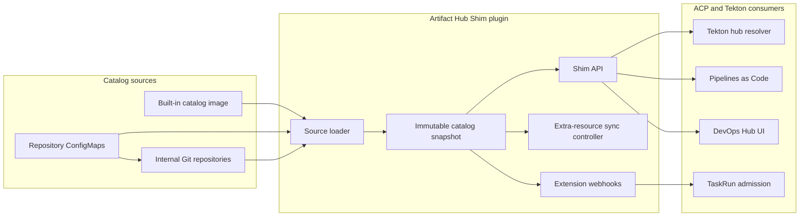

# Architecture

Artifact Hub Shim separates catalog ingestion from catalog consumption. The API
builds an immutable in-memory snapshot from packaged and Git-backed sources,
then serves that snapshot through interfaces expected by Tekton and the ACP
DevOps UI. An optional extension handles admission-time visibility checks and
TaskRun template rendering.

## Core Components

### Catalog Sources

The built-in catalog is delivered as an image with the plugin, so it remains
available without internet access. Administrators can add Git-backed sources by
creating labeled repository `ConfigMap` resources. A source definition selects
the Git URL, revision, catalog paths, optional credentials, and visibility
scope.

The source loader materializes each source independently. An invalid or
temporarily unavailable source is reported without preventing valid sources
from being indexed. For configuration details, see
[Configure Custom Git Repositories](../how_to/configure_custom_git_repositories.mdx).

### Immutable Catalog Snapshot

The index normalizes supported Tekton resources, detects conflicting package
identities, resolves catalog aliases, selects the latest version, and applies
disabled-package rules. A completed refresh atomically replaces the active
snapshot, so consumers do not observe a partially updated catalog.

### Compatibility API

The API Deployment exposes three groups of endpoints:

- Artifact Hub-compatible package and search endpoints used by the Tekton hub
  resolver.
- Hub UI-compatible list, detail, and manifest endpoints used by ACP DevOps.
- Health, readiness, and snapshot-status endpoints used for operations.

The in-cluster Service is the integration endpoint for Tekton and Pipelines as
Code. A separately rendered Ingress provides the ACP DevOps Hub UI route.

### Extension Webhooks

The extension is deployed separately from the read API and can provide:

- validation of namespace, project, or allowlist catalog visibility for Tekton
  `ResolutionRequest` objects;
- rendering of catalog-provided mail and execution-overview templates into
  `TaskRun` resources.

The extension can be disabled independently if its admission behavior must be
rolled back. Disabling it does not stop the catalog read API.

### Extra-Resource Synchronization

Catalog repositories can include explicitly labeled extra `ConfigMap`
resources such as tool-image definitions and templates. A leader-elected sync
controller writes only to configured namespaces, records ownership, avoids
adopting unrelated objects, and prunes obsolete managed objects unless they
carry the Artifact Hub Shim keep annotation.

## Security Boundaries

- UI-compatible endpoints authenticate the request and authorize `get` or
  `list` access to the virtual `hub.tekton.dev/resources` resource.
- Native resolver requests have no end-user credential. The extension performs
  admission-time visibility checks for local Tekton resolution when enabled.
- Git credentials are read from Kubernetes `Secret` resources and are not
  returned by catalog APIs.
- Chart RBAC limits extra-resource writes to explicitly allowed namespaces.

For detailed authentication and RBAC settings, see
[Chart Configuration](../configure/chart_configuration.mdx#ui-api-rbac).

## Availability and Storage

Read replicas operate independently from the active immutable snapshot. A
multi-replica deployment must use pod-local `emptyDir` runtime storage. PVC
storage is supported for a single replica when retaining repository checkouts
or payload content across pod recreation is useful. For supported combinations,
see [High Availability](../configure/high_availability.mdx).
